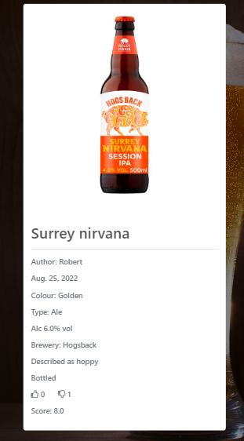
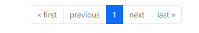
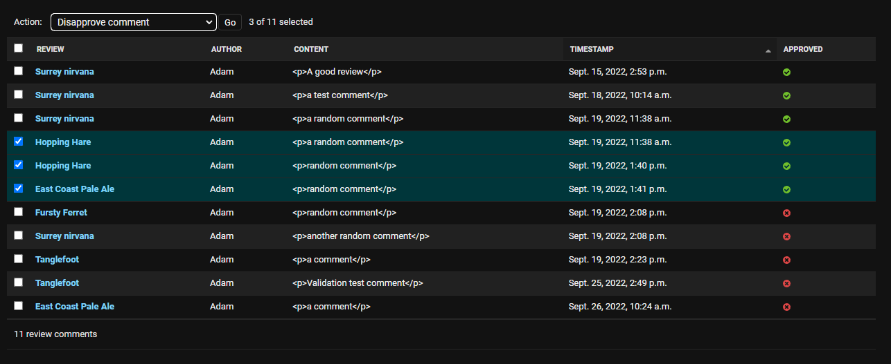
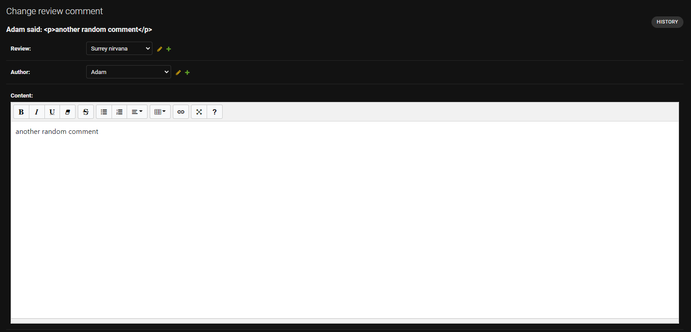
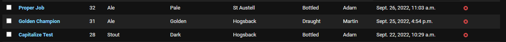
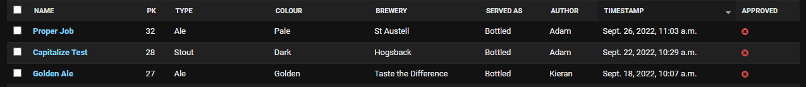
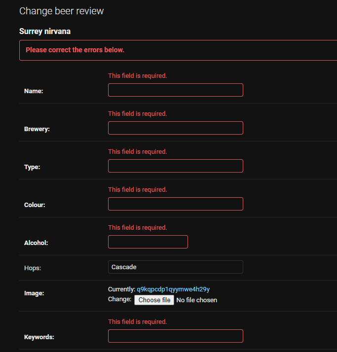
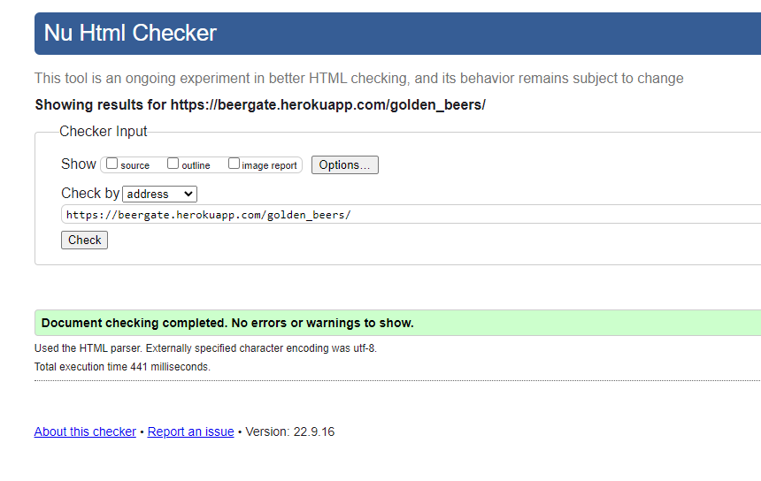
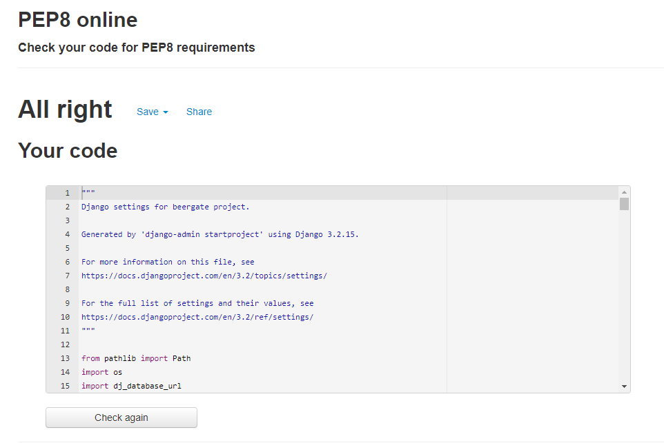

# **Beergate**

## Code Institute Portfolio Project 4 - a Full Stack website using the Django framework and a database

Am I response image here

# **Table of Contents**

- [Scope](#scope)
- [Background](#background)
- [Audience](#audience--users)
- [User Stories](#user-stories)
    - [Admin user User Stories](#admin-user-user-stories)
    - [Generic user User Stories](#generic-user-user-stories)
        - [Rejected Generic user Stories](#rejected-generic-user-user-stories)
    - [Unregistered user User Stories](#unregistered-user-user-stories)
    - [Registered user User Stories](#registered-user-user-stories)
        - [Rejected Registered user User Stories](#rejected-registered-user-user-stories)
- [Features](#features)
    - [Based](#base)
    - [Header and navbar](#header-and-navbar)
    - [Footer](#footer)
    - [Landing Page](#landing-page)
        - [Review cards](#review-cards)
        - [Pagination](#pagination)
        - [Sorting and filtering](#sorting-and-filtering)
    - [Review Page](#review-page)
    - [Add Review Page](#add-review-page)
    - [Update Review Page](#update-review-page)
    - [Delete Review Page](#delete-review-page)
    - [Search Results Page](#search-results-page)
    - [User Reviews Page](#user-reviews-page)
    - [AllAuth pages](#sign-in-sign-out-sign-up-and-change-password-pages)
    - [Messages](#messages)
    - [404 and 500 error pages](#404-and-500-error-pages)
- [Function](#function)
    - [Reviews app](#reviews-app)
        - [Models](#reviews-models)
            - [Review](#review-class)
                - [Review class methods](#review-class-methods)
            - [Comment](#comment-class)
                - [Comment class methods](#comment-class-methods)
        - [Views](#reviews-views)
            - [Index Views](#index-views)
                - [Default View](#default-view)
                - [Sorting Views](#sorting-views)
                - [Filtering Views - type](#filtering-views---type)
                - [Filtering Views - colour](#filtering-views---colour)
                - [Filtering Views - served as](#filtering-views---servedas)
            - [Review View](#review-view)
            - [Search Results View](#search-results-view)
            - [User Reviews View](#user-reviews-view)
            - [Add Review View](#add-review-view)
            - [Update Review View](#update-review-view)
            - [Delete Review View](#delete-review-view)
            - [Voting Views](#review-upvote-and-review-downvote)
        - [Forms](#reviews-forms)
            - [Comment Form](#commentform)
            - [User Review Form](#userreviewform)
        - [URLs](#reviews-urls)
        - [Admin](#reviews-admin)    
    - [User app](#user-app)
        - [User Views](#user-views)
        - [User Forms](#user-forms)
        - [User URLs](#user-urls)
- [Deployment](#deployment)
- [Tasks](#tasks)
- [Future Work](#future-work)
- [Bugs](#bugs)
    - [Initial Deployment bug](#initial-deployment-bug)
    - [Superuser login bug](#superuser-login-bug)
    - [Object list bug](#object-list-bug)
    - [Username bug](#username-bug)
    - [Add Review URL bug](#addreview-url-bug)
    - [Slug field bug](#slug-field-bug)
    - [IMPORTANT - Project Fatal Error and Restart bug](#important---project-fatal-error-and-restart)
    - [Cloudinary Image upload bug](#cloudinary-image-upload-bug)
    - [Tab duplication bug](#tab-duplication-bug)
    - [Upvote - Downvote mutual exclusivity bug](#upvote---downvote-mutual-exclusivity-bug)
    - [AllAuth email server bug](#allauth-email-server-bug)
    - [Image sizing bug](#image-sizing-bug)
    - [Background and placeholder image serving bug](#background-and-placeholder-image-serving-bug)
    - [Mobile device layout bug](#mobile-device-layout-bug)
    - [Update review automatic disapproval bug](#update-review-automatic-disapproval-bug)
    - [Rich Text Editor bug](#rich-text-editor-bug)
    - [Navbar collapse bug](#navbar-collapse-bug)
    - [Review Magic String method bug](#review-magic-string-method-bug)
    - [Explicit context declaration bug](#explicit-context-declaration-bug)
    - [Review card float bug](#review-card-float-bug)
    - [Supplementary information improvement](#supplementary-information-bug)
    - [User Reviews bug](#user-reviews-bug)
    - [Search Results pagination bug](#search-results-pagination-bug)
    - [Too many navbar items bug](#too-many-navbar-items-bug)
    - [Landing Page pagination improvement](#landing-page-pagination-bug)
    - [Random Review bug](#random-review-bug)
    - [Comments HTML not escaping bug](#comments-html-display-bug)   
- [Development Choices](#development-choices)
- [Testing](#testing)
    - [Manual User Story testing](#manual-user-story-testing)
        - [Admin user User Story testing](#admin-user-user-story-testing)
        - [Generic user User Story testing](#generic-user-user-story-testing)
        - [Unregistered user User Story testing](#unregistered-user-user-story-testing)
        - [Registered user User Story testing](#registered-user-user-story-testing)
    - [Other Manual testing](#other-manual-testing)
        - [Superuser adds a review in the admin panel](#superuser-adds-a-review-in-the-admin-panel)
        - [Superuser edits a review in the admin panel](#superuser-edits-a-review-in-the-admin-panel)
        - [Superuser adds or edits a comment in the admin panel](#superuser-adds-or-edits-a-comment-in-the-admin-panel)
        - [Normal user adds a review without filling in mandatory field](#normal-user-adds-a-review-without-filling-in-mandatory-fields)
        - [Normal user edits a review and deletes data in mandatory fields](#normal-user-edits-a-review-and-deletes-data-in-mandatory-fields)
        - [Normal user submits an empty comment](#normal-user-submits-an-empty-comment-from-a-review-page)
        - [Normal user adds a review with invalid integer values](#normal-user-adds-a-review-and-supplies-values-of-1-or-10-to-last-4-fields)
    - [Validation testing](#validation-testing)
        - [HTML validation](#html-validation)
            - [Index](#index)
                - [# Default - reviews sorted by newest](#default---reviews-sorted-by-newest)
                - [Reviews sorted by most upvotes](#reviews-sorted-by-most-upvotes)
                - [Reviews sorted by oldest](#reviews-sorted-by-oldest)
                - [Reviews filtered by Ale type](#reviews-filtered-by-ale-type)
                - [Reviews filtered by Stout type](#reviews-filtered-by-stout-type)
                - [Reviews filtered by Lager type](#reviews-filtered-by-lager-type)
                - [Reviews filtered by Pale colour](#reviews-filtered-by-pale-colour)
                - [Reviews filtered by Golden colour](#reviews-filtered-by-golden-colour)
                - [Reviews filtered by Amber colour](#reviews-filtered-by-amber-colour)
                - [Reviews filtered by Dark colour](#reviews-filtered-by-dark-colour)
                - [Reviews filtered by bottled beers](#reviews-filtered-by-bottled-beers)
                - [Reviews filtered by draught beers](#reviews-filtered-by-draught-beers)
            - [Review](#review)
                - [Review page standard](#review-page-standard)
                - [Review page after comment submission](#review-page-after-comment-submission)
            - [Search Results](#search-results)
                - [Search results page with returned reviews](#search-results-page-with-returned-reviews)
                - [Search results page with no reviews returned](#search-results-with-no-reviews-returned)
            - [User Reviews](#user-reviews)
                - [Use case 1 - user has no reviews](#use-case-1---user-has-no-reviews)
                - [Use case 2 - user has one review awaiting approval](#use-case-2---user-has-one-review-awaiting-approval)
                - [Use case 3 - user has all reviews awaiting approval](#use-case-3---user-has-all-reviews-awaiting-approval)
                - [Use case 4 - user has some reviews approved and some awaiting approval](#use-case-4---user-has-some-reviews-approved-and-some-awaiting-approval)
                - [Use case 5 - user has all reviews approved](#use-case-5---user-has-all-reviews-approved)
            - [Add Review](#add-review)
                - [Fresh Add Review form](#fresh-addreview-form)
                - [Add Review form submitted](#add-review-form-submitted)
                - [Add Review page when signed out](#addreview-page-when-signed-out)
            - [Update Review](#update-review)
                - [Prepopulated Update Review form](#pre-populated-updatereview-form)
                - [Update Review form submitted](#update-review-form-submiited)
                - [Update Review page when signed out](#updatereview-page-when-signed-out)
            - [Delete Review](#delete-review)
                - [Modal inactive](#modal-inactive)
                - [Modal active](#modal-active)
            - [Account Sign In](#account-sign-in)
            - [Account Sign Out](#account-sign-out)
            - [Account Sign Up](#account-sign-up)
            - [#Account Password Change](#account-password-change)
        - [CSS validation](#css-validation)
        - [JS validation](#js-validation)
        - [Python validation](#python-validation)
            - [Beergate settings.py](#beergate-settingspy)
            - [Beergate urls.py](#beergate-urlspy)
            - [Reviews urls.py](#reviews-urlspy)
            - [Reviews admin.py](#reviews-adminpy)
            - [Reviews forms.py](#reviews-formspy)
            - [Reviews models.py](#reviews-modelspy)
            - [Reviews urls.py](#reviews-urlspy)
            - [Reviews views.py](#reviews-viewspy)
            - [User forms.py](#user-formspy)
            - [User view.py](#user-viewspy)
            - [User urls.py](#user-urlspy)
    - [Automated testing](#automated-testing)
- [Technologies](#technologies)
- [Other Notes](#other-notes)
- [Credits](#credits)

# **Scope**

The scope of this project is to create a website using the Python Django framework. The website will function as a review site for people who like beer, similar to [RateBeer](https://www.ratebeer.com/). 
  
The project will use the Django AllAuth library to allow users to create accounts and log in to the website. Once they have logged in, users will be able to post reviews of beers to help other users expand their tastes. Logged-in users will also be able to upvote and downvote these reviews, and post comments. Users will be able to update and delete their own reviews.
  
The project will also feature several mechanisms for searching, sorting and filtering database entries.
  

# **Background**

This project is inspired by the Code Institute Whiskey Drop walkthrough project that was used to demonstrate the power and responsiveness of Bootstrap. Since I am more of a beer drinker than a whiskey drinker, I made my own variation that I called Beergate. [This is the repository](https://github.com/AdamBoley/bootstrap-experimentation), and [this is the deployed site on Github Pages](https://adamboley.github.io/bootstrap-experimentation/).
  
As a beer drinker, I enjoy exploring different beers, rather than sticking to the same brewers. The UK has a large community of small breweries who collectively produce a huge number of different beers. Given the large variety of different hops, malts and brewing techniques these breweries use, beers can differ greatly in colour and taste. 
  
Whilst this makes the UK a gold-mine for beer drinkers, it presents a problem for the breweries themselves. With so many beers and so much variety, the market is effectively saturated, making it difficult for small breweries to stand out and make their products widely known.
  
This is where this project comes in. If a user finds and drinks a good beer, they can use this project to write a review, recommending (or not) that beer to the wider beer-drinking community. Similarly, users who wish to expand their range of beers can use this project to find recommendations, or know what beers to avoid. 

# **Audience / Users**

This project is aimed at the large community of beer drinkers in the UK who want to read reviews of different beers so that they can find more beers that they may want to try. 

# **User Stories**

Below are the User Stories used to guide the development of BeerGate.

## **Admin user User Stories**

The Admin user User Stories were used to determine what Admin Superusers who have access to the Admin panel should be able to do.

- As an Admin user I can...
    - Navigate to the admin sign-in page, so that I can sign in to the admin panel
    - Sign-in via the admin sign-in page so that I can access the admin panel
    - View all beer reviews submitted by users, so that I can see how many beer reviews exist in the database
    - Filter and sort all beer reviews easily, so that I can see all of the reviews that fulfil certain criteria
    - Quickly approve any number of selected beer reviews so that they become visible on the site
    - Quickly disapprove any number of selected beer reviews so that they stop being visible on the site
    - Quickly delete any number of selected beer reviews, so that they no longer take up memory in the database
    - Fully edit a beer review, including rich text and images, so that I can improve the quality of poorly-written reviews
    - Add a beer review of my own, so that I do not have to use the add_review page on the front-end
    - View all comments submitted by users, so that I can see how the community is reacting to certain reviews
    - Filter and sort all comments easily, so that I can see all of the reviews that fulfil certain criteria
    - Quickly approve any number of selected comments so that they become visible on their parent review page
    - Quickly disapprove any number of selected comments so that they stop being visible on their parent review page
    - Quickly delete any number of selected comments so that they no longer take up memory in the database
    - Fully edit a comment, including rich text, so that I can improve the quality of poorly-written comments
    - View all extant users, so that I can see how many people have signed-up to use BeerGate
    - Delete any number of extant users, so that I can stop malicious users from submitting comments and reviews
    - View login attempts from dummy admin honeypot page, so that I can see if BeerGate is being attacked by malicious users

## **Generic user User Stories**

These user stories were used to determine what all users should be able to do, regardless of authentication status.

- As a generic user I can ...
    - Immediately determine the purpose of the application when first visiting, so that I can quickly decide whether to stay or leave
    - Have a positive user experience regardless of how I am accessing the application, so that I can access the application from any web-enabled device
    - View all beer reviews so that I can choose one to read in full
        - At the same, not be overwhelmed by reviews so that I have a bad experience and cannot make a decision
    - Sort and filter all beer reviews so that I can see only the beer reviews that appeal to me
    - View any single beer review in its entirety so that I can read the full content
    - Use a search function to search for beer reviews using keyword terms so that I can get a collection of reviews to read
        - If my search returned no results, have that reflected back to me, so that I can search by different parameters
    - If an error occurs, be reassured that it has not broken the website, so that I do not have a poor user experience
    - If an error occurs, have a means of resetting the website or getting out of the error, so that I can continue using the site

### **Rejected Generic user User Stories**

These user stories were rejected as the features that would fulfil them were too difficult to implement.

- As a generic user I can ...
    - Chain multiple sorting and filtering criteria together on the landing page to more precisely control the review I can see
    - Have my sorting or filtering criteria reflected back to me so that I know which criteria I have applied

## **Unregistered user User Stories**

These user stories were used to determine what unregistered users specifically should be able to do.

- As an unregistered user I can ...
    - Sign-up and create an account, so that I can access the full functionality of the application
    - Sign-in to that created account, so that I can access the full functionality of the application

## **Registered user User Stories**

These user stories were used to determine what registered users specifically should be able to do.

- As a registered user I can ...
    - Sign in to a previously created account, so that I can access the full functionality of the application
    - Change the password for that account, so that it becomes more memorable
    - Sign-out easily, when I am already signed-in, so that I can be sure that I have closed my session securely
    - Have my sign-in status reflected back to me, so that I can be sure that I have signed-in
    - Write a beer review easily, so that I can share my thoughts on a beer with the community
        - Apply rich text formatting to the content of my review, so that I can better express myself and provide additional structure to my review
        - upload an image to my review, so that I can show other users what the beer looks like
    - If signed in, easily list all of the reviews that I have written, so that I can easily access them
        - If I have written no reviews, have that reflected back to me, so that I know that I have not written any
    - Easily update any beer reviews that I have written, so that I can improve or modify the content
    - Easily delete any beer reviews that I have written, so that I can delete a review that I am not happy with
        - At the same time, require some effort to be put in to the deletion process, so that I cannot accidentally delete any beer reviews
    - Be informed when I have posted a comment, so that I can be assured that I have submitted the comment
    - Be informed when I have posted a review, so that I can be assured that I have submitted the review
    - Be informed when I have updated a review, so that I can be assured that I have updated the review
    - Be informed when I have deleted a review, so that I can be assured that I have deleted the review
    - When viewing a single beer review, post a comment, so that I can share my thoughts on the beer and review
    - When viewing a single beer review, upvote it, so that I show my approval of the review if I like it
    - When viewing a single beer review, downvote it, so that I can show my disapproval of the review if I do not like it

### **Rejected Registered user User Stories**

These user stories were rejected as the features that would fulfil them were too difficult to implement.

- Rejected user stories:
    - Be able to upvote comments, so that I can show my approval of comments I agree with
    - Be able to downvote comments, so that I can show my disapproval of comments I disagree with
    - Be able to access the update_review page from within the user_reviews page, so that I can easily navigate to the update form 
    - Be able to access the delete_review page from within the user_reviews page, so that I can easily navigate to the deletion form

# **Features**

This section discusses the features and pages of BeerGate and the design choices made. Where appropriate, there is discussion of the HTML and CSS. The views and forms used to render those pages are also mentioned. 

## **Base**

BeerGate uses a single base template file that is applied to every page. This provides a consistent user experience. The base template contains a Bootstrap navbar and a small footer. The HTML code from the other templates is injected into a central `main` element. The background image used is one of a tall glass of beer, the same image used in the [first Beergate project](https://adamboley.github.io/bootstrap-experimentation/). A 50% opacity dark background has been applied over this image to darken it off. This is because the unmodified image is particularly bright and eye-catching. The unmodified image is below:

## **Header and Navbar**

The navbar provides navigation to the other pages of BeerGate. The navbar was created using a standard Bootstrap navbar, so as to make it smoothly responsive on smaller screen sizes. Each list item in the navbar has been given the Bootstrap `btn` class to turn it into a button. Functionally, this has been used to apply a nice rounded border when the button is hovered over, and custom CSS has been written to turn the button white and keep the text black when this happens. This provides clear user feedback so that the user knows that they are about to click a button and be redirected to another page.

All users, regardless of authentication status, may view the default landing page by clicking either the bolded `BeerGate` icon or the `Reviews` button. They may also be directed to a random single review by clicking the `Random review`. Finally, they may sort and filter the reviews displayed on the landing page by using the options contained within the `Sort and filter` dropdown menu button. This is discussed in greater detail [below](#sorting-and-filtering). Finally, users may search the database for reviews using the search input box. These are displayed in a separate search results page. A search is triggered by pressing the Search button or by pressing the `enter` key. By default, Bootstrap places the search box on the right-hand side of the page, and I have left this unchanged. The intention is to semantically separate the search function from other website functions. This appears to be common practice in website design - sites such as [Reddit](https://www.reddit.com/), [Facebook](https://www.facebook.com/) and [RateBeer](https://www.ratebeer.com/) all have search bars that are distinctly separated from other content.

If the user is signed out or has not yet created an account, their navigation options beyond those above are limited to either signing-in to an extant account or creating a new account. A user may create an account by clicking on the `Sign Up` button, or sign in to an existing account by clicking the `Sign In` button.

If the user is signed-in, they have more navigation options. The user may click on the `Add a review` button to be taken to a page where they may create and upload a beer review of their own. The `Signed in as <username>` button works like the `account actions` or `your profile` buttons of other websites. This button has two functions - firstly it displays the user's username, letting them know that they are signed in, and secondly it is a dropdown menu that contains account options. There are three account options. Firstly, users may access all of the reviews that they have authored and that have been approved by clicking the `My reviews` option. Secondly, users may change their account password by clicking the `Change password` option. Thirdly, users may sign out by clicking the `Sign Out` option.

## **Footer**

The footer contains standard copyright information that identifies BeerGate as my intellectual property. 

## **Landing page**

The landing page is the first template rendered to the user when they visit the deployed project - [Beergate](https://beergate.herokuapp.com/). The landing page is rendered from `templates/index.html` using the `ReviewList` view. The main content of the landing page are 3 'review cards', so called because each holds a link to a particular review, and because each is created using a Bootstrap card. 

Final Landing page screenshot:

### **Review cards**

Each review card provides a brief overview snippet of a particular beer review. Each card provides quick information to a user that helps them decide which review to visit, such as the type and colour of the beer, when it was reviewed and the number of upvotes and downvotes. A user may click anywhere on the card to be directed to the associated review. I initially had only the name of the beer wrapped in the anchor element, however user testing on a mobile device indicated that it was sometimes difficult to tap the hyperlink, and too-small hyperlinks are a particular bugbear of mine. Modifying the template so that the entire card in within the anchor element allows a user with a mobile device to tap anywhere on the card to visit the review page.

The review page is discussed in more detail [below](#review-page).

Single review card screenshot:

### **Pagination**

The landing page is set to display review cards in batches of 3. Further reviews are paginated. The pagination element offers users a wide range of navigation options. They may be redirected to the first and last pagination pages by clicking the buttons labelled `first` and `last`. Users may also access the pagination pages directly prior to and directly after their current page with the buttons labelled `previous` and `next`. Finally users may access any particular pagination page by clicking on the appropriate numbered square. If any of the `first`, `last`, `previous` or `last` options are not available, then the button still displays, but is greyed-out and has no active href attribute. This was implemented to provide a consistent style as the user navigates the paginated pages. The original code that was used to provide these pagination options did not have these features and hence inactive buttons disappeared, which led to an inconsistent style. 

Pagination was implemented to save mobile users from having to endlessly scroll through reviews. 

Screenshot of pagination bar:

### **Sorting and Filtering**

Aside from the search function, I considered that users might want to view particular categories of reviews, such as only viewing ales or golden beers. Hence, I implemented some functionality that allows a user to sort and filter the reviews displayed on the landing page. By default, records are displayed in descending timestamp order, i.e. with the newest records first. A user may sort the reviews in two other ways - by descending upvote count, with the reviews with the highest number of upvotes displayed first, and  also by ascending timestamp order, with the oldest reviews displayed first. 

A user may also filter the records by various properties.

Firstly, they may filter by broad beer type - Ale, Stout and Lager. If any of these options are selected, only reviews of Ales, Stouts or Lagers will be displayed. 

Secondly, a user may filter by beer colour - Pale, Golden, Amber and Dark. If any of these options are selected, only reviews of Pale, Golden, Amber or Dark beers will be displayed. 

Finally, a user may filter by whether the beer, when reviewed, was served bottled or draught. This was included because a beer can taste different depending on whether it is drunk bottled or on draught, so it is perfectly possible to have two separate reviews of the same beer - one in which the beer was served bottled and another in which it was served on draught. In addition, if a user is looking to purchase bottles of beer from a supermarket, then reviews of draught beers would be unhelpful. Similarly, if the user is in a pub with draught beers, reviews of bottled beers would be unhelpful.

Each of these sorting and filtering functions is rendered using its own view using the index template.

These options, particularly the filtering options are necessarily broad and hence will not catch every review, as reviews submitted with a type or colour that does not match these filters will not be displayed. The intention is to provide broad, common filters to users. The search bar acts as a necessary companion, as it allows more specific and targetted searches. 

Final screenshot of sorting and filtering bar:

## **Review page**

The review page is used to display a single beer review in its entirety. It is rendered using the review template and the ReviewSingle view. The review is held in a standard Bootstrap card. All the relevant fields in a record are displayed within this card, including the beer's name, brewery, image, content and scores. The output of the short_description and description methods are also displayed. Notably, the hops field is specifically missing, as I decided to make this field optional when a user submits a review, as the hops a beer is brewed with may not be readily available to the reviewer.

As with the navbar, the review page changes depending on the user's authentication status. If signed in, a user may upvote and downvote that review by clicking on the thumbs-up and thumbs-down buttons. These buttons are mutually-exclusive - upvoting a review will cause an extant downvote by the user to be removed, and downvoting a review will cause an extant upvote by the user to be removed. This particular feature was inspired by Reddit, which allows posts and comments to be upvoted or downvoted, not both. If the user is not signed-in, the upvote and downvote buttons are disabled and will instead just display the extant upvote and downvote totals.

Below the upvote / downvote section is the comment section. If a review has no comments posted, the comments section will inform the user of this. If the user is signed-in, they may post a comment. I debated whether to make the comment submission field a rich text editor or a standard text field. Ultimately I went with a rich text editor because I wanted users to have the ability to add formatted comments. When a comment is submitted, it requires approval from an administrator before it is displayed, so a text box will display informing the user of that. 

Additionally, at the bottom of the card, there is a back button that directs the user back to the default landing page. This provides an alternative to the user's browser back button. 

If the the user is signed-in, and if the user is the author of that review, then they may update their review or delete it using the named buttons

Final screenshot of upper review page:

Final screenshot of lower review page:

Final screenshot of comment submission message:

## **Add Review page**

The add_review page is rendered using the add_review template and the AddReview view.

The add_review page allows a user to write and submit a beer review of their own. This is done via a form. The user must enter all of the necessary information about the beer - the name, brewery, type, colour, alcohol content, some keyword descriptors, their full review, and then their score in each of 4 categories - aroma, appearance, taste and aftertaste. The hops field is optional, as I considered that a user may not have ready access to this information. The user may also upload an image, though this is optional. If no image is uploaded, the review will display a placeholder image. The user must select whether the beer was served bottled or on draught, defaulting to bottled.

As with review comments, reviews are not automatically displayed, as they must be approved by an administrator. When submitted, a message will display informing the user of this. This is to ensure that a user is not using the add_review page to post malicious, offensive or inappropriate content.

Final screenshots of add review page:

Final screenshot of review submission message:

## **Update Review page**

The update_review page is rendered using the update_review template and the UpdateReview view. It functions similarly to the add_review template as the form uses the same form template and fields, except that the form fields are pre-populated with the extant records. A user may update any of the review's information, including the image. When submitted, the record is automatically disapproved, and a text box displays informing the user of this. This is to ensure that a user is not using the update functionality, which by default does not automatically disapprove a review, to post malicious, offensive or inappropriate content.

Final screenshots of update review page:

Final screenshot of review update message:

## **Delete Review page**

The delete_review page is rendered using the delete_review template and the DeleteReview view. It is a simple template, and allows a user to delete a particular review. Rather than having a simple button to do this, I considered that placing the actual delete button inside a modal would provide a superior user experience, to prevent a review being deleted by accident. In this way, a user must actively seek to delete a review. When a review is deleted, the review no longer exists in the database, so the user is redirected back to the homepage. 

Final screenshot of delete review page:

Final screenshot of delete review page with confirmation modal active:

## **Search Results page**

The search_results page is rendered using the search_results template and the SearchResults view. The page consists of a Bootstrap card which contains all of the reviews returned by the search query. Similarly to the landing page, the entirety of each search result is contained within an anchor element linking to the particular review. Due to the particular structure and intended look of this page, I had some difficulty making it responsive to smaller screen sizes. In particular, the images proved troublesome. To overcome this issue, I set the images to be hidden on these smaller screen sizes. As each search result is placed within an anchor element, the text within each search result card is given anchor element styling - namely a blue colour and underline text decoration. I removed this native styling for most of the text elements, but kept it for the beer name, with the intention being to mimic the Google search results page, where the clickable links have unmodified anchor element styling. 

The reasoning for placing the entirety of each search result within an anchor element is the same as that applied to the landing page - it aids tapping for mobile device users. 

The search_results page supports pagination, as a search could return dozens of records.

Final screenshot of upper search results page:

Final screenshot of lower search results page:

Final screenshot of search results pagination:

## **User Reviews page**

The user_reviews page is rendered using the user_reviews template and the UserReviews view. The design is intentionally very similar to that of the search_results page, including the lack of images on smaller screen sizes, as I view both pages as a means of listing some collection of reviews, though obviously the difference lies in *how* that collection is assembled - this is dicussed in more detail in the Function section. The only noticable difference is that the user_reviews page's search results do not display the author of the reviews. As the author of the review is the user themselves, I considered this to be redundant.

The idea behind the implementation of this page is to allow a user to quickly see all of the reviews that they have written, so that they can update or delete them in one place, and also quickly see the number of upvotes and downvotes that other users have made against their reviews. The page also allows users to quickly visit each of their reviews to see the comments other users have posted.

The current build of the UserReviews view does not allow for pagination. I recognise that this is an area of potential improvement.

Final screenshot of user_reviews page:

## **Sign In, Sign Out, Sign Up and Change Password pages**

These pages are modified versions of the standard AllAuth templates that can be copied over from the site-packages directory with the `cp -r ../.pip-modules/lib/python3.8/site-packages/allauth/templates/* ./templates` command. A new app called 'user' was started to hold the views, forms and urls that control these templates, primarily to apply the Bootstrap `form-control` class that makes the input elements smooth and nice to use with user feedback.

Final screenshot of Sign In page:

Final screenshot of Sign Out page:

Final screenshot of Sign Up page:

Final screenshot of Change Password page:

## **Messages**

Late in development, I noted that when a user changes their password, they are not redirected to the landing page as they are when they create an account, sign-in or sign-out. Whilst this proved eacy to achieve ([see below](#user-views)), I considered that users might appreciate a more declarative means of confirming that they have undertaken an action, much like the success messages that trigger when they add or update a review. I hence ported over much of the code for implementing messages from the walkthrough project, modifying the Bootstrap positioning classes for improved responsivity. I also have the container div absolute positioning so that it does not interfere with the review cards of the landing page. Without absolute positioning, the review cards 'jump' upward when the messages div is closed, since Bootstrap removes the messages element from the DOM when closed. To prevent the messages element from overlapping the review cards, I gave the review cards container a top padding of 3em. This does not meaningfully influence the positioning of the review cards.

I noted that, for some reason, the close button for the alert message is not positioned to the right-hand-side, as might be expected, instead appearing directly next to the text. Setting the messages div element to have `position-relative` and the close button to have `position-absolute` and the using the `top-25 end-0` classes solved this.

Sign in success message:

Sign out success message:

Sign up success message:

Change password success message:

## **404 and 500 error pages**

At the urging of my Mentor, I created custom 404 and 500 error pages. These are simple pages, designed to be humourous so as to reassure the user that they have not irreversibly broken BeerGate. Both pages provide links back to the landing page.

404 page:

500 page:

## **Admin Panel**

As a Django project, BeerGate has an admin panel that is only accessible to superusers. Once they have accessed the admin panel, superusers may:
- List all submitted beer reviews
- Update and delete any submitted review
- Change the approval status of a review so that it will appear on the main application
- List all submitted comments
- Update and delete and submitted comment
- Change the approval status of a comment so that it will appear on the review page of its parent beer review
- List all authenticated users
- Delete any user
- Edit the information of any user
- Promote any user to staff or superuser status
- Review any attempts to sign in to admin panel via the dummy admin honeypot page

Screenshots of the various featurs of the admin panel are available in the [validation section](#admin-user-user-story-testing)

# **Function**

This section is discusses the code used in the project, and explains any particularly note-worthy or obscure features.

## **Reviews app**

The Reviews app is where the bulk of the project's development took place, and holds most of the back-end code.

### **Reviews Models**

BeerGate uses two data models - Review and Comment. A validation function called `validate_within_limits` has also been written to validate inputs for the Review model's aroma, appearance, taste and aftertaste fields. These are IntegerFields, but the values must be between 1 and 10. Testing of this function is dealt with in the [testing section](#testing)

#### **Review class**

Review is the primary data model for BeerGate. As of the end of the project's development cycle, it contains 18 fields. The name, brewery, type, colour and keywords fields are all standard character fields. The image field is a CloudinaryField, as uploaded images are saved to my account on the Cloudinary CDN.

The content field is a TextField, but this was not always the case. As noted elsewhere, I initially used the django-summernote package to apply the Summernote Rich Text Editor, but this caused a fatal error that required the project to be restarted. When the project was restarted, I used the CK-editor package, which supplies a custom field type called RichTextField. When this package did not work on the deployed app, I switched to using the django-tinymce package in hopes of using the TinyMCE Rich Text Editor, which supplies a custom field type called HTMLField. Again, this did not work on the deployed app, so I went back to using the django-summernote package. Unlike the other two, the django-summernote package merely requires a widget called SummernoteWidget to be applied to a standard TextField in the corresponding forms file.

A late addition to the Review model was the served_as field, which is an IntegerField. It operates similarly to the status field of the Django Blog walkthrough project, in that the served_as field takes values defined within an external global variable, which is in this case called SERVED_AS. The served_as field determines whether the beer was served bottled or on draught, as the same beer can taste differently depending on how it is served.

The upvotes and downvotes fields are ManyToMany fields linked to the standard Django User model, since many users can upvote and downvote many reviews. I decided early on to include separate upvotes and downvotes fields since I am an avid user of Reddit, but I dislike Reddit's choice to combine upvotes and downvotes into a single number, as a user cannot see the total number of upvotes and downvotes. With separate upvote and downvote counts, both numbers can be displayed, so that users can see how many people agree with a review, and how many people disagree, so as to be as well-informed as possible.

The author field is a standard ForegignKey field linked to the Django User model. It has the `ondelete=models.CASCADE` instruction so that if a user is deleted from the database then all of that user's reviews are deleted as well.

The timestamp field is standard DateTimeField with the `auto_now_add=True` instruction so that the exact date and time that a review was submitted is captured.

The approved field is a BooleanField with a default value of False. This field palys a considerable role in the security and defensive programming of BeerGate. As discussed below, reviews that are not approved are not displayed to users, and must be manually approved by an administrator. This field ensures that malicious users cannot post inappropriate or offensive reviews.

The aroma, appearance, taste and aftertaste fields are standard IntegerFields, with validation being handled by the validate_within_limits function. These fields provide quick numerical scores of beers. These were added after I found [RateBeer](https://www.ratebeer.com/), and noted that said site allows numerical scores. I felt that using numerical scores along with class methods to do something with these would elevate the project. I am a member of CAMRA, and so I was able to find the criteria used by their judges in the Champion Beer of Britain competition.

Early versions of the Review model used a slug field with the SlugField type, which was used to generate custom URLs, much as like in the Django Blog walkthrough project. However, this proved to be an obstacle to mass-approval of reviews in the admin panel. As in the walkthrough project, the slug field was set to be pre-populated, but I discovered that this pre-population only occurred when each individual record was accessed. Should users collectively submit hundreds of reviews, an administrator would need to access each record to pre-populate the slug field, which would be a huge time-sink. When this was discovered, the slug field was removed and the project converted to use the primary_key of each Review instead.

##### **Review class methods**

The Review model contains a number of methods. The first of these is a standard Meta class, which supplies the verbose name and ordering of the reviews.

There is also a standard string method, the so-called 'magic method', which returns a text string containing the name of the beer and the author's name.

The get_absolute_url method specifies the redirection URL, which is used when upvoting and downvoting reviews, as these reload the page.

The description method returns a composite text string containing the beer's colour, type and brewery. This returns something like "A Golden Ale by Hogsback".

The short_description method returns the keywords field in a more user-friendly way, much like the magic string method. It returns something like "Described as Hoppy, zesty and bitter".

The review_upvotes and review_downvotes methods are quite simple and return total counts of the number of upvotes and downvotes applied to a review. These are injected into various templates as a measure of how highly or lowly rated a review is.

The average_score method averages the values of the aroma, appearance, taste and aftertaste fields to provide a single overall score for a beer.

#### **Comment class**

The Comment model is a secondary data model for BeerGate. It provides the functionality for users to comment on Reviews.

The review field is a ForeignKey field that links a comment to a particular Review, much like the author field does for the Review model. It has the `ondelete=models.CASCADE` so that should a Review be deleted, all attached comments will be deleted as well.

The author field is a ForeignKey field that functions identically to the author field of the Review model.

The content field is a standard TextField. I have chosen to use the SummernoteWidget in the forms file to make this field into a RichTextEditor, so as to give commenting users the same rich text formatting options as they have when writing reviews.

The timestamp and approved fields function identically to those fields of the same name in the Review model.

The upvotes and downvotes fields function identically to those fields of the same name in the Review model. However, at the time of writing, I was unable to implement upvoting and downvoting of comments, as Reddit allows a user to do, primarily because the voting function for Reviews reloads the page, using the primary key of the review as the redirection URL. Nonetheless, I have decided to keep these fields in the model with a view to implementing such functionality at a later date. The total numbers of upvotes and downvotes are never displayed on the front-end, so a user will never know that the model contains those fields.

##### **Comment class methods**

As with the Review model, the Comment model contains a Meta child class that supplies a verbose name and ordering. In contrast to the Review model, comments are ordered in ascending timestamp order, so that the oldest comments appear first. As in the walkthrough project, the intention is to mimic a conversation around the review and the beer. 

The Comment model also contains a magic string method that returns a string of text containing the author and the content of the comment. It returns something like "Robert said: Nice review!"

### **Reviews Views**

#### **Index views**

I have written a large number of views that render various versions of the the landing page using the index.html template. A view called LandingPage acts as a base. LandingPage is not used to render a page directly. Instead, the other index views inherit from it. LandingPage sets the model, template_name and pagination factor, but leaves the queryset to be defined by the inheriting views.

In previous builds, each index view defined the model, template_name, pagination factor and queryset individually. During the 'tidy-up' phase of development, I considered that this was a violation of DRY principles, so I set the index views to inherit from the LandingPage view, so that should I need to change the pagination factor, model or template name, I would only have to change it in one place. Each index view only defines a unique queryset.

The justification for these various index views is [here](#ordering).

##### **Default view**

The default view is called ReviewList, and the queryset filters the reviews to include only those that have their approved field set to True, and orders these in descending timestamp order, so that the newest reviews are displayed first.

##### **Sorting views**

There are two other views which apply different sorting instructions.

ReviewListMostUpvotes uses the annotate method to get the total number of upvotes for each Review, and then orders Reviews by this number. This allows users to view the most highly rated reviews first. The annotate method works similarly to the review_upvotes method of the Review model, in that it counts the number of upvotes and returns this count so that it can be used by other methods.

ReviewListOldest is nearly identical to the default ReviewList view, except that it orders Reviews in ascending timestamp order, so that the oldest reviews are displayed first.

##### **Filtering views - type**

The ReviewListAleType, ReviewListStoutType and ReviewListLagerType function similarly to the default ReviewList view, filtering out those reviews that are not approved and ordering by descending timestamp order. These views also filter by the Review model type field.

ReviewListAleType filters out beers that do not have Ale as their type.

ReviewListStoutType filters out beers that do not have Stout as their type.

ReviewListLagerType filters out beers that do not have Lager as their type.

##### **Filtering views - colour**

These views are called ReviewListPaleColour, ReviewListGoldenColour, ReviewListAmberColour and ReviewListDarkColour. These function similarly to the default ReviewList view, filtering out those reviews that are not approved and ordering by descending timestamp order. These views also filter by the Review model colour field.

ReviewListPaleColour filters out beers that do not have Pale as their colour.

ReviewListGoldenColour filters out beers that do not have Golden as their colour.

ReviewListAmberColour filters out beers that do not have Amber as their colour.

ReviewListDarkColour filters out beers that do not have Dark as their colour.

##### **Filtering views - served_as**

These views are called ReviewListBottled and ReviewListDraught These function similarly to the default ReviewList view, filtering out those reviews that are not approved and ordering by descending timestamp order. These views also filter by the Review model served_as field.

ReviewListBottled filters out beers that do not have 1 (meaning bottled, since served_as is an IntegerField) as the served_as value.

ReviewListDraught filters out beers that do not have 2 (meaning draught, since served_as is an IntegerField) as the served_as value.

#### **Review view**

The view that renders the entirety of a single review using the review.html page is called ReviewSingle.

This view holds two methods - a get method and a post method. These are little different from the PostDetail view of the walkthrough project, except that in each method I have chosen to explictly define a variable called context to hold the object that holds the various key - value pairs that can be used in the template. I consider that this is a more pythonic way of doing things, and I generally prefer explict variable declarations anyway.

The get method defines a queryset containing all approved Reviews, and then retrieves a specific review using the `get_object_or_404` method, using the review's primary key, pk. It also retrives that review's comments, and defines two variables - upvotes and downvotes, both set to False. If the user is signed-in and has previous upvoted or downvoted that review, then either the upvoted or the downvoted variable is set to True. The specific review is then rendered in the return statement using the render keyword, the review.html template and the context variable.

The post method functions similarly, except that it has additional code to handle the submission of the CommentForm. If the submitted CommentForm is valid, the user and the current review are attached to the comment submission, so that the comment 'belongs' to that particular user and that review. In the context, commented is set to True, which triggers some templating language code to display a submission confirmation textbox to the user.

#### **Search Results view**

The SearchResults view renders the search_results page using the search_results.html page. The object_list, which holds the reviews that are displayed, is constructed using the get_queryset method, which retrieves the search term used in the navbar's search box input element as a variable called query. The object_list is then constructed using a standard filter method that uses [Q Objects](https://docs.djangoproject.com/en/4.0/topics/db/queries/#complex-lookups-with-q-objects) to chain filters together. The code in this view was written using [this tutorial](https://learndjango.com/tutorials/django-search-tutorial), authored by known Django expert Will Vincent. The object_list is the returned for use within the template using templating language.

#### **User Reviews view**

The UserReviews view renders the user_reviews page using the user_reviews template. Previous builds were relatively simple, using get method to construct a queryset consisting of all reviews belonging to a particular user that have been approved. 

In the current build, the get method is more complex. It defines two querysets - `user_queryset_all` and `user_queryset_approved`. The first queryset contains all of the reviews authored by the user, regardless of approval status. The second queryset contains all of the approved reviews authored by the user. The get method then considers 5 use cases with an IF/ ELIF/ ELSE statement, defining a context for each and rendering the page using a return statement. 

Use case 1 triggers if the user has written no reviews, hence `user_queryset_all` is empty. The templating language in user_reviews uses an `empty` tag to render a text box that informs the user that they have written no reviews.

Use case 2 triggers if the user has written 1 review, and if that review has not been approved. The context triggers a templating language statement that informs the user of this.

Use case 3 triggers if the user has written any number of reviews, and none of the them have been approved. The context triggers a templating language statement that informs the user of this.

Use case 4 triggers if the user has written any number of reviews, and some of them have been approved. The context triggers a templating language statement that informs the user of this. The user's approved reviews are displayed as well.

Use case 5 triggers if all of the user's review have been approved. All of the user's reviews are displayed, with no additional text box. 

This logic was implemented to more finely control the content displayed to the user. 

#### **Add Review view**

The AddReview view renders the add_review page using the add_review template. This is, if you will, the meat of the project, as it allows a user to upload a beer review using a form. The form itself is rendered using the form_class variable set to the imported UserReviewForm. In previous versions of the project, as in the walkthrough project, a get method was used to render this form. Using the form_class variable reduces the amount of code required considerably, and thereby reduces complexity. The UserReviewForm is discussed in more detail [here](#userreviewform).

Form submission is handled using the post method. This functions similarly to the code that handles comment submission in the ReviewSingle view, essentially checking if the submitted form is valid, and the attaching the user ID if so, so that the review 'belongs' to that particular user. Additional lines of code ensure that the `name`, `brewery` and `hops` field inputs are titled, and that the `type` and `colour` field inputs are capitalised. These were added for two reasons. Firstly, the filtering views that filter by `type` and `colour` are case-sensitive. If the `type` and `colour` field inputs are not capitalised, the filtering views will not include them. For example, the ReviewListAleType view filters by `type = Ale`, so only reviews with a type field input of `Ale`, specifically capitalised, will be included in the queryset. Whilst non-capitalised field inputs could be easily recified in the admin panel, this sort of menial work is better handled by a computer. The second reason is that the `name` and `brewery` field inputs are injected into the templates, and having each word capitalised makes the app feel more professional. The title() method was used because the names of many beers and breweries consist of multiple words, such as the beer called Surrey Nirvana or the brewery Bear Island. The `hops` field is currently not injected, but the field input was titled should this be changed. In addition, the `keywords` field input is lowercased using the lower() method. The reasoning is similar to that for capitalising the `name` and `brewery` field inputs - the `keywords` field is injected into the templates, but in this case, as part of a sentence starting with `Described as`. Having random capital letters in the middle of a sentence is jarring and distracting.

This is necessary to ensure that the sorting and filtering views work properly, as the filter methods used therein are case-sensitive. The capitalise method has the added, and to me surprising, effect of converting all-uppercased inputs (e.g. type = STOUT or colour = PALE) to standard capitalised inputs (e.g type = Stout or colour = Pale).

A context variable is then defined and a return statement renders the template again, this time with the reviewed key set to True, which triggers some templating language to display a textbox informing the user that their review has been submitted and is awaiting approval. 

#### **Update Review view**

The UpdateReview view renders the update_review page using the update_review.html template. This a necessary companion to the AddReview view, as it allows a user to update their reviews. As with the AddReview, a form_class variable specifies that the UserReviewForm is to be used. The view uses 3 methods - a get method, a post method and a form_valid method. These methods are necessary because I wanted this view to automatically disapprove reviews when they are updated. As discussed in the [bugs section](#bugs), this is a prudent security measure and part of the defensive programming employed in BeerGate. I found that without these methods, when the form is submitted, the review instantly and automatically holds the updated information. This is a vulnerability that a malicious user could exploit, first by submitting a seemingly-genuine review, getting it approved and then updating it with malicious, inappropriate or offensive content.

Full credit for the design of these methods goes to [this Reddit question](https://www.reddit.com/r/django/comments/8jkh5t/updateview_creates_new_items_in_the_db_instead_of/), where the author appears to have had a similar issue, and they answer their own question. I confess that I do not fully understand what these methods are doing, but my understanding is as follows:

The get method retrieves the particular review that is being updated and the form that is being used. The post method handles the submission of the form containing the updated information. I have added a line of code that sets the updated review to be disapproved inside the IF statement block. The form_valid method then saves the updated information to the database. The return statement that renders a context is my own work, which sets the updated flag to True. This in turn triggers some templating language code in the template that informs that user that their updated review is awaiting reapproval.

Within the post method is code similar to that employed in the AddReview view which variously titles and capitalises the `name`, `brewery`, `hops`, `type` and `colour` field inputs, and lowercases the `keywords` input. This is to ensure that a user cannot accidentally update a review so that the filtering methods stop catching it, and to ensure that the user cannot damage the user experience for other users by de-capitalising these fields (or uppercasing/capitalising the keywords field).

#### **Delete Review view**

The DeleteReview view renders the delete_review page using the delete_review.html template. This view uses the generic Django DeleteView which allows easy deletion of records. Once the review has been deleted, the success_url variable redirects the user back to the landing page.

#### **Review Upvote and Review Downvote**

The ReviewUpvote and ReviewDownvote views handle upvoting and downvoting of reviews. They are essentially identical, and the core code borrows heavily from the walkthrough project's PostLike view. I have made my own additions inside the ELSE blocks of the post methods which makes upvotes and downvotes mutually exclusive - that is, a user may either upvote or downvote a review, not both, and if a user has previously upvoted a review, then downvoting it will remove the extant upvote, and vice versa. Once a vote has been applied, the user is redirected back to the review they were voting on.

### **Reviews Forms**

The forms file contains two form classes - CommentForm and UserReviewForm. As is the case in the walkthrough project, these forms are explicitly defined because I wanted to specifically control which fields were displayed. In addition, I wanted to apply the Bootstrap `form-control` class to makes the forms nicer to use. I was able to use the widgets variable to apply the `form-control` class. Later on, the widgets variable helped get the django-summernote Rich Text Editor working by way of the SummernoteWidget. I was also able to use the labels variable to modify the labels of the form input elements.

#### **CommentForm**

The CommentForm class is quite simple - it sets that the only field to be displayed is the content field, which is made into a Rich Text Editor by way of the SummernoteWidget. The label is also modified to 'Your comment'.

#### **UserReviewForm**

The UserReviewForm class appears to be more complex, but is functionally similar to the CommentForm. It restricts the fields that are displayed and applies the `form-control` class to those fields, with the exception of the content field, which is turned into a Rich Text Editor using the SummernoteWidget. The widget object also allowed me to add the placeholder attribute to several fields which meant that I could add assistive placeholder text.

### **Reviews URLS**

The urls file holds the urlpatterns for the reviews app. Most of the paths apply to the previously-mentioned sorting and filtering views that render various versions of the landing page. After these comes the add_review, search and user_review pages. Lastly come the paths which render the review pages and the pages for updating and deleting records, as well as the upvote and downvote paths. As previously mentioned, reviews are not listed by their slug but instead by their primary key, so for paths that deal with specific records, `<int:pk>` is used instead of `<slug:slug>` as in the walkthrough project.

I learned early on in development that paths that take in arguments are considered more general, and must hence be placed below more specific paths. Prior to learning this, an error would occur whenever I tried to naviagte to the add_review page. Thankfully Tutor Support were able to teach me this. As it turned out, I had all of the pieces in place, and the ordering of the urlpatterns was the only barrier.

### **Reviews Admin**

The admin file controls the layout of, and actions available in, the Django admin panel. Functionally, it is little different to the admin file of the walkthrough project. There are two classes - BeerReviewAdmin and CommentAdmin - thanks to my going back to using the django-summernote package, both admin classes extend the SummernoteModelAdmin class.

Both admin classes are also similar in construction, as both have the same control variables - list_filter, list_display, search_fields, actions and summernote_fields. The list_display control variable within both classes has been given terms that allow an administator to quickly see the pertinent meta-data of a review - beer name, beer type, colour, brewery, timestamp, approval status, and the author.

Both admin classes have the same two methods - approve_beer_review / approve_comment and disapprove_beer_review / disapprove_comment. The approve methods are used for mass approval of all selected reviews whilst the disapprove methods are used for mass disapproval (i.e. mass withdrawal) of all selected reviews.

## **User app**

The user app was started purely to achieve better control over the rendering of the signin.html, signout.html, signup.html and password_change.html templates. Primarily, the goal was to apply the Bootstrap `form-control` class to the forms. After doing this with the CommentForm and UserReviewForm in the reviews app, this proved quite easy, however in order to use the custom forms, I had to create custom views.

It should be noted that I created forms and views for all of the AllAuth functions, not just signing in, signing out, signing up and changing passwords. After doing so, I tested these and noted that only those named functions worked out-of-the-box. The others, such as resetting a password, required an email service. After speaking with my Mentor about this, he suggested keeping the views and forms and then removing the paths from the urls.py file, thus disabling them and ensuring that they could not be accessed accidentally. Getting this functionality working will be something to work on in the future after project submission.

### **User Views**

As noted above, the only views in user/views.py that are in active used by BeerGate are UserSignInView, UserSignUpView and UserPasswordChangeView. There is no custom view for the user signout functionality because while that template has a form, it only consists of a submit button and hence has no need of the `form-control` class.

The active views are very simple, only using the form_class and template_name variables to designate the form and template to be used. The UserSignInView extends the AllAuth LoginView, the UserSignUpView extends the SignupView and the UserPasswordChangeView extends the PasswordChangeView.

The UserPasswordChangeView is somewhat notable because it specifies a `success_url`, which redirects the user back to the homepage. This is not necessary for the other views because the redirection URL is specified in the settings file as `LOGIN_REDIRECT_URL = '/'` and `LOGOUT_REDIRECT_URL = '/'`.

### **User Forms**

As with the views, only the UserSignInForm, UserSignupForm and UserPasswordChangeForm are actively used by BeerGate, with the others dormant until their corresponding views can be put into use.

Initially I tried using the widgets method shown in reviews/forms.py to apply the `form-control` class to forms, but this failed. I then found [this Medium article](https://gavinwiener.medium.com/modifying-django-allauth-forms-6eb19e77ef56) (as a Medium article, access might be restricted), which suggested using an `__init__` method within each form class to apply the `form-control` class.

The UserSignupForm and UserChangePasswordForm use a for loop to apply a `form-control` widget to each form field. However, this approach failed with the UserLoginForm, since this form has a 'remember me' checkbox, which, when given the `form-control` class, becomes an input field that cannot accept any input. To overcome this, I used another technique from that article to apply the `form-control` class to only the username and password input elements. This itself proved difficult, since the name of the username field is unhelpfully called 'login' rather than 'username', as might be expected.

### **User URLS**

As noted above, the user/urls.py file's urlpatterns list only contains 3 paths. These are for the signin, signup and password_change pages. In the future, as I get the remaining AllAuth functionality working, corresponding paths will be added to allow these templates to be accessed.

# **Database Models**

As a Full Stack project that uses Django, this project uses models to create the database tables. These are below, and include the column headers, examples of what might be in that column and other relevant notes.

## **Beer**

The Beer model is used to create a table that holds all of the data to make a beer review post.

| Column Header      | Example             | Other notes                                                      |
| -------------------|---------------------|------------------------------------------------------------------|
| name               | Golden Champion     | Unique(?), CharField, primary key?                               |
| brewery            | Hogsback            | CharField, One to Many since one brewery can make multiple beers |
| type               | Lager / Stout / Ale | CharField                                                        |
| colour             | Amber / Pale / Dark | CharField                                                        |
| alcohol_content    | 4 / 5.5             | DecimalField(max_digits=3, decimal_places=1)                     |
| image              | an image            | Cloudinary image                                                 |
| slug               | golden-champion     | SlugField, generated from name to create unique URLs             |
| content            | This beer is a beer | TextField, forms main content of post                            |
| keywords           | Hoppy / Malty       | CharField                                                        |
| hops               | American / Indian   | CharField, the hops used in the beer                             |
| upvotes            | 112                 | ManyToManyField, since many users can upvote many posts          |
| downvotes          | 21                  | ManyToManyField, since many users can downvote many posts        |
| author             | John Smith          | ForeignKey, from User table, on delete cascade                   |
| created_on         | 32nd of January     | DateTimeField                                                    |
| approved           | boolean yes/no      | BooleanField, I approve as admin superuser                       |
| aroma              | 8                   | IntegerField, with validation to accept values between 1 and 10  |
| appearance         | 5                   | IntegerField, with validation to accept values between 1 and 10  |
| taste              | 10                  | IntegerField, with validation to accept values between 1 and 10  |
| aftertaste         | 4                   | IntegerField, with validation to accept values between 1 and 10  |
| Aroma              |                     | The smell of the beer - does it smell good or bad                |
| Appearance         |                     | Colour, clarity, head and visual carbonation                     |
| Taste              |                     | How does it taste - is it overly bitter, too weak or just right? |
| Aftertaste         |                     | How the taste lingers in the mouth                               |

The Beer model will have a Meta class that orders reviews by created_on in descending order, so that the newest reviews are displayed first

The Beer model will also have a magic string method to return the name of the beer, and two methods that deal with the numbers of upvotes and downvotes, one for each. These methods will return a count of these numbers so that they can be displayed.

## **Comment**

The Comment model is used to create a table that holds all of the information to display a comment on a beer review post. 

| Column Header      | Example             | Other notes                                                      |
| -------------------|---------------------|------------------------------------------------------------------|
| post               | Guinness            | ForeignKey(Beer), on delete cascade                              |
| author             | Bob Smith           | ForeignKey(User), on delete cascade                              |
| body               | I agree with this   | TextField                                                        |
| created_on         | 33rd of February    | DateTimeField                                                    |
| upvotes            | 54                  | ManyToManyField, since many users can upvote many comments       |
| downvotes          | 67                  | ManyToManyField, since many users can downvote many comments     |

The Comment model will have a Meta class that orders comments by created_on in ascending order, so that the oldest comments are displayed first. 

The Comment model will also have a magic string method to return the comment itself followed by the name of the commenter. The Comment model will also have two other methods that deal with the numbers of upvotes and downvotes, one for each. These methods will return a count of these numbers so that they can be displayed.

### **Discussion**

The post and author fields will both be Foreign Keys, and will have on_delete=models.CASCADE. This means that the comment will be removed if the parent review is deleted, or if the author's account is deleted. As above, this is intended as a defensive measure, so comments made by malicious users are deleted if that malicious user's account is deleted. 
 
The Meta class that orders comments by created_on date so that the oldest comments are displated first is intended to simulate a conversation, so that other users can follow any discussion in the comments of a post.

# **Tasks**

Done:
- implement upvotes / downvotes feature for Beer Reviews - done 
- Implement a Summernote content field or other rich text editor for user-generated posts - done using CKeditor
- Look into an error displayed when creating a new account. Account appeared to be created successfully (I was able to log in with it), but got a Django error page with Error 111 Connection Refused - No longer a problem
- If a user attempts to submit a duplicate review - i.e same author and same beer name, an error is thrown. Need something to handle this - done thanks to move to display by primary key
- It does appear that when uploading a post from the site that a slug is not automatically generated - no longer an issue as slug removed
- Find fix to the problem on images not uploading - use cloudinary image upload(https://cloudinary.com/documentation/django_image_and_video_upload) - fixed and documented
- implement functionality to allow users to update, and delete their posts - both done, full CRUD functionality
- For the admin backend, add a disapprove method, so that several previously-approved reviews can be made inactive at the same time, much like several unapproved reviews can be approved at the same time.
- implement an exclusivity feature - if a user upvotes, remove their downvote, if user downvotes, remove their upvote so that they cannot do both at the same time

- Style AllAuth forms with Bootstrap - done
    - Steps:
        - Start new app called 'user'
        - add 'user' to beergate/settings.py INSTALLED_APPS
        - In that, add a forms.py and a urls.py
        - in forms.py, import the AllAuth LoginForm and SignupForm
        - create custom UserLoginForm and UserSignupForm classes, and use them to extend the LoginForm and SignupForm respectively
        - in settings.py, override standard AllAuth forms using the ACCOUNT_FORMS variable
        - Per [this Medium article](https://gavinwiener.medium.com/modifying-django-allauth-forms-6eb19e77ef56), add code to apply widgets to form fields that add the Bootstrap CSS form-control class
        - Import these custom forms into user/views.py
        - Create UserLoginView and UserSignupView, which extend the AllAuth LoginView and SignupView
        - assign these views the relevant form_class and template_name, being sure to prefix the template with account/, since the templates are located in the account directory
        - create paths in user/urls.py, importing the necessary views

- Style additional AllAuth forms with Bootstrap - done
    - email
    - password_reset_from_key
    - password_reset
    - password_set
    - plus AllAuth templates without forms

- Implement modal for delete_review.html so that a user must manually confirm deletion - done
- [Implement a search bar function](https://learndjango.com/tutorials/django-search-tutorial) - done
- add `logged in as: {{ user.username }}` to base.html somewhere, so the user can confirm that they are logged in
- Implement functionality to allow a user to see their own reviews - done
- use `` control statements to provide custom titles for html pages - done
- Find a way to list all of a particular user's posts for easy access - done
- Background image not displaying on deployed site - done, documented in bugs section
- Review generic placeholder image - done, new image will much greater resolution used which is better for the review.html page
- Provide a consistent aspect ratio for post images - done by sizing the image-container element using bootstrap classes
- Not all cards displaying on mobile devices - done by reworking html structure and css rules
- Fix bug related to UpdateReview creating a new record - done
- Implement Django HoneyPot - done
- Add settings.py booleans to enhance security - done
- Apply bootstrap to search results and user reviews page - done
- Larger, bolder, more prominent font on navbar - done
- CKeditor rich text field not displaying on deployed site, including mobile devices- done by implementing Summernote

- For a user-written beer review form:
    - need a completed BeerReviewForm in forms.py - done
    - need a new view in views.py - done
    - need a context in the return render of the view - done
    - need a template and front-end links to that - done
    - need a path in urls.py for that template - done
    - Add some functionality to handle an improperly completed form. Apply this to the comment form as well (for example if a user tries to submit an empty form). 
    - update admin.py with an approve beer review action - done

- Offer an option of ordering reviews by the number of upvotes - use a dropdown menu or some type of selector (in navbar?) Then render different index views based on that selection

- Implement functionality to broadly sort reviews by type and colour
    - use index.html and ListView
    - expand navbar dropdown menu
    - dropdown divider to separate different sorting parameters
    - use filter in view
    - sort by type - ale, stout, lager
    - sort by colour - pale, amber, dark
    - principle is to sort by broad characteristics
    - each needs its own view for sorting on index template
    - for readme - Martin is not a beer drinker, so the search bar is less useful due to lack of familiarity with terms, so dropdown menu provides clearer sort function
    All Done

- Update data model to allow a user to select whether a beer is bottled, draught, etc, and then filter results by this - expand navbar filtering - done
    - Update data model to include a 'served_as' IntegerField - done
    - Above Review model, designate a global SERVED_AS variable = `(0, 'draught'), (1, 'bottled'))` - done
    - In IntegerField, use choices=SERVED_AS, default of 0 - done
    - https://stackoverflow.com/questions/5924988/radio-buttons-in-django-forms for more
    - and https://stackoverflow.com/questions/27321692/override-a-django-generic-class-based-view-widget/27322032#27322032
    - in widgets - 'served_as': forms.RadioSelect - done
    All Done

- Remove unused AllAuth URLS in urls.py, keep views and templates - done
- add more content to index cards to better reflect any sorting that has been applied - done
- comment disapproval method not working due to spelling error - done
- Navbar fails to render properly on horizontal tablets - screen widths 992 to 1400px / lg to xxl breakpoints - done
- review reviews/admin.py to see if more terms need to be added to the control variables - done
- Footer - done
- In ReviewSingle view, UserReviews view and AddReview, explicitly define a context variable to hold the object in the return statement, then call context in that return. Do same with template_name variable - done
- add return of average_score method to index card - done
- Fix issue of floated card content becoming misaligned at smaller screen sizes - done
- decreased number of cards on index page to 3 so that background image is less obscured - done
- User_reviews does not filter out unapproved reviews - done
- look into pagination for search_results and user_reviews pages - done for search_result page
- add more content to search results and user reviews pages in the same vein as index
- Place My Reviews, Sign-out and Change Password behind an 'Account actions' dropdown menu to make navbar less busy
- Implement improved pagination model to index page - done
- Implement a random 'surprise me' feature - done
- Add a request to users to upvote or downvote reviews - "this helps push good reviews up the rankings" - done
- Harmonise login, log out, signup to sign-in, sign-out and sign-up - done
- Find and apply a favicon - done
- Custom 404 and 500 error pages - done
- add class and method docstrings - done
- Capitalise or title AddReview `name`, `brewery`, `hops`, `type` and `colour` field inputs - done
- Capitalise or title UpdateReview `name`, `brewery`, `hops`, `type` and `colour` field inputs - done
- Lowercase AddReview and UpdateReview `keywords` field input - done
- After submitting a User Review Form, add a link to submit a new review to the success text box - done
- Simplify views.py class names - done
- Add blank and null to Hops field, modify input label to be specifically optional - done
- Maintain consistent pagination style across all paginated pages
- update image field label in add_review and update_review to explictly make it optional - done
- Soundly note change to new repository thanks to summernote editor - done
- Note removal of AllAuth Urls, and retention of views, forms and template for future work - done
- ensure all templating language is properly indented - done
- implement messages
- On search results page, invite user to perform another search if theirs returns no reviews - done
- Landing page with no reviews needs pagination bar pushed down - done
- Rework early part of Bugs section, esp. parts that deal with old project - done

In progress:

- Review and update Bootstrap card structure for non-AllAuth templates:
    - base / navbar - logged-in note for collapsed navbars
    - index
    - review 
        - main image is rather large so reduce size - done
        - centre comment rich-text field - more difficult
    - add_review - try to centre the rich-text editor box
    - update_review - increase width, use same layout as add_review - done
    - delete_review - add link to update the review - done
    - user_reviews - in progress
    - search_results - in progress
- Style AllAuth templates - sign-in, sign-up, login, logout, email, password, etc - 

- Testing section for exhaustive manual testing - outline in place

- Exhaustive manual testing

To do:

- Explictly state the number of reviews the user has vs how many are approved on the user_reviews page. Define in context using len? or use templating count?

- Consider using a new method for UpdateView: https://docs.djangoproject.com/en/3.2/topics/forms/modelforms/#the-save-method - override save method?

- The SECURE_SSL_REDIRECT and SECURE_HSTS_SECONDS security settings provided last session caused localhost to fail
    - Is it acceptable to not include these?
    - Use a conditional - if working in deployment, apply these settings

- How to create a view to order by the output of a class method
    - average_score method 
    - Ronan will look into this

- give bugs section titles for each bug

- Modify Reviews so that they have realistic content, not just Lorem Ipsum bulk text

- Have enough records in the database so that all sorting and filtering views work and can be demostrated

Readme:

- Add screenshots of all pages to Readme
- Upload wireframes to readme
- add line-breaks for clearer structure

Rejected:
- add update and delete buttons to user_reviews so that a user does not have to access each record individually - rejected as not possible, since the entire search result card is itself an anchor element, it cannot have other anchor elements as children

- In UserReviewForm, apply bootstrap to RadioSelect widget with name, class, etc - rejected as unnecessary, since the extant radio buttons are clear enough

- Modify sorting to use a checkbox group like [Games Workshop](https://www.games-workshop.com/en-GB/Warhammer-40-000) - rejected as too complex, and too far along in development to implement a major feature like this

- Allow the superuser (user ID = 1) to update and delete all posts as well as users, so that the admin does not have to use the admin panel - rejected as this could compromise security:
    - This could be a security issue - if there is a partial security breach, where the superuser's admin credentials are compromised, then the dummy admin page still offers some protection. The attacker may have the admin credentials, but cannot put them to use beyong deleting or updating the admin's reviews
    - if this feature is implemented, then an attacker can essentially have access to the admin panel from the front-end
    - also, if more superusers are added, then this feature may fail or would need to be recoded
    - My Mentor's thoughts are:
        - This is separation of concerns issue
        - superuser update/delete works fine in the admin panel
        - The security concern is valid, since I have a 2-layered defence
        - It is also a violation of DRY, since Django ships with a admin panel

- Use the checking thing to check if a user is the post's author - if so, remove/disable the upvote button, or trigger it automatically - rejected as too difficult
    - adding an upvote automatically is difficult, since the add_review function does not allow an upvote to be assigned during the upload/save process

- Optional purchased_from CharField in Review - rejected as unncessary. The beer name and brewery should be sufficient if a user wishes to search for a place to buy the beer from, plus it could prove confusing for users submitting reviews of draught ales

- Display the total number of comments on the index, search_results, user_reviews pages using a context - rejected as too difficult

- Move sorting menu from universal navbar to its own navbar only on the index page - perhaps use a def get method to render a custom context that informs/reminds the user of the criteria they are filtering/sorting by - rejected because this is too difficult

# **Future Work**

Future work:
- Implement upvotes / downvotes feature for Comments, possibly by using asynchronous upload

- Display number of approved comments attached to each review on the index, search_results and user_reviews pages. [This article](https://stackoverflow.com/questions/50365624/display-total-number-of-comments-related-to-each-object-in-a-list-view) may assist

- Extend User model to include a profile picture and other information - display this on the navbar and below each beer review

- Add higher-level AllAuth functionality - social media sign in, password complexity, confirmation emails, etc

- Modify UserSignUpForm in user/forms.py to include additional first_name and last_name fields

# **Bugs**

Given the complexity of Django, it was inevitable that many bugs were encountered. To assist navigation, each bug has been given its own heading. Each is also separated by horizontal rules. 

### **Initial deployment bug**

When trying to deploy an initial blank version of the project to Heroku, I ran into an error, with Heroku logging the error `unable to build wheel for backports.zoneinfo`. Some Googling revealed that the problem could be to do with the version of Python that Heroku uses, and that a possible fix could be to add a `runtime.txt` file to the repository to specify the exact version of Python that should be used. Said file was added with `python-3.8.13`. In the end, I noted that this was extraneous, since INSTALLED_APPS was missing a comma. Once added, Heroku was able to build and deploy the app properly. The `runtime.txt` file was removed. 

### **Superuser Login bug**

After creating a superuser to access the Django backend, I ran into a 403 error when trying to login using that superuser via the admin login page. Some Googling found [this StackOverflow page](https://stackoverflow.com/questions/70285834/forbidden-403-csrf-verification-failed-request-aborted-reason-given-for-fail/70326426#70326426). Though this should apply only to Django v4.x.x , where I specifically installed Django v3, as per the walkthrough videos. 

Running the command `python3 -m django --version`, obtained from [this StackOverflow page](https://stackoverflow.com/questions/6468397/how-to-check-django-version), to check the version of Django installed, I found that the project was using Django v4. The Django documentation says that Django v4.1 was released on 3/8/22, about 4 days before I tried to access the backend. I can only conclude that Django upgraded from v3 to v4.1 automatically. 

To solve the error, I found [this StackOverflow page](https://stackoverflow.com/questions/29573163/django-admin-login-suddenly-demanding-csrf-token), which provided a line of code that must be added to settings.py:

`CSRF_TRUSTED_ORIGINS = ['https://*.YOUR_DOMAIN.COM']`, replacing `YOUR_DOMAIN.COM` with the URL of the Gitpod workspace I was using, prefixed with `8000-` to account for the development server. 

This worked, and allowed me to login to the Django backend without issue. The code above appears to override the need to provide a CSRF token when performing actions from this workspace. This may present a vulnerability, as a CSRF token is Django's way of protecting sites against malicious users, and the code in settings.py overrides that.

This ceased to be an issue when I downgraded to Django 3.2, so the code was removed. This note exists should purely to document the issue should it recur. 

### **Object List bug**

When attempting to render an BeerReview database entry, I initially could not get a Bootstrap card holding the various fields to display. I thought that this may have been a problem with my views. Where the Django Blog uses a status field to mark a post as either draft or published, I am merely using an approved field, and then filtering posts to display by the boolean value in the approved field. Removing this stipulation did not work. 

I then viewed the index.html page in the Dev Tools and found that the card was not even rendering, and that the code was stopping at the Templating Language For Loop. I had been using for `beer_review in beer_review_list`. I then consulted the [Django documentation on class-based views](https://docs.djangoproject.com/en/4.1/topics/class-based-views/generic-display/), and found that their example code uses `for publisher in object_list`. I followed their pattern and changed `beer_review_list` to `object_list`. This worked, and the index page displayed the test beer review that I had made in the database. 

### **Username bug**

When adding the code to allow a user to post a comment on a beer_review_single page, I encountered a ValueError - `Cannot assign "<username>": "Comment.author" must be a "User" instance`.

The offending code was in the views.py file, and had been:
`comment_form.instance.author = request.user.username`, per the walkthrough video on adding comments. 

Some Googling revealed that another developer had encountered a similar issue when using Django, who asked [this question](https://groups.google.com/g/django-users/c/cKd3t7yQzFo). An answer recommended using `author=request.user` that instance, which I thought might apply to my code. I removed `.username` from the code and I was then able to submit a comment as expected. A check of the Django admin panel showed that the comments had been submitted successfully, and were awaiting approval. Once approved, only the comments' created_on fields were displaying properly. A check of the code revealed that I had been ported over the HTML code from the walkthrough project without changing the fields to reflect those of my models. Since my Comment model and the walkthrough's Comment model share a created_on field, only this was displaying initially. Once the fields had been updated, the comment displayed properly.

### **AddReview URL bug**

When adding a form that would allow users to post beer reviews, I encountered a 404 error where the user_review.html page could not be located, despite being present. Tutor support were eventually able to find the problem - the AddReview url path had to be above the ReviewSingle path, per the [URL dispatcher documentation](https://docs.djangoproject.com/en/4.1/topics/http/urls/). Once this had been implemented, the page displayed as expected. However, the form did not display. This proved easy to diagnose - in views.py I had `"user_review": UserReviewForm()` in the dictionary of the return render, whereas I was using `user_review_form` in the templating language of `user_review.html`. Changing the view code to `user_review_form` caused the form entry fields to be displayed as expected. A quick test using a beer called Surrey Nirvana from the Hogsback brewery confirmed that the form was working and had been submitted to the backend. Logging in as the superuser allowed me to approve this entry, and it was then displayed as expected.

### **Slug field bug**

After designing and implementing the functionality to allow a user to submit a review, a bug was noted that did not allow more than one review to exist in the admin area without being reviewed. The reason is that a review's slug is generated in-situ when viewed in the admin area, and the slug is used to generate urls. The slug field in the Review model is set to be unique, the reasoning being that urls should be unique. I reason that even an empty slug field, is considered by the admin as being valid, so therefore there cannot be more than 1 review with an empty slug field, and an empty slug field is by itself unique. 
Two solutions present themselves:
- make slug fields non-unique, allowing more than one review to exist with an empty slug review
    - this opens up potential errors with redirection to other-than-intended beer_review_single pages, should two beer reviews have the same slug
    - the odds of this are low - why would a user submit two reviews of the same beer?
    - This would also prevent mass-approval of reviews, as these reviews would have the same empty slug field
- remove the slug field, and load beer_review_single pages by primary key instead
    - each beer review has a unique primary key

Ultimately I went with the second solution, though this did require some major reworking of the project so that reviews were loaded by their primary key instead of their slug. 

### **IMPORTANT - Project Fatal Error and Restart**

When I decided to implement the solution to the bug above, I decided to remove the slug field from the Review Model. When migrating this change, an error occured with django summernote needing to make a migration as well. Why summernote needed to do so I cannot say, but this presented a major obstacle that i was unable to find a work-around for. Ultimately, I decided to restart the project using a fresh repository, workspace, database and Heroku app. This repository - Project Beergate - should be viewed as a continuation of the old project - [Beergate](#https://github.com/AdamBoley/Beergate). Whilst annoying, I took the opportunity to redesign parts of the project, changing some Model and field names for increased clarity and ease-of-use, and using the Django CKeditor library instead of Summernote to provide rich text fields. Commit #4, made at 14.27 on 18/8/22, added many files and changes that might normally have been added over several commits. This is because these files were merely copied over from the old project, with those changes as described above. The changes are:
 

- BeerReview changed to Review, and within that model:
    - created_on field changed to timestamp
    - beer_name changed to name
    - alcohol_content changed to alcohol

 

Within Comment(unchanged):
- beer_review changed to review
- created_on changed to timestamp

### **Cloudinary Image Upload bug**

When designing the user review form that allows users to submit their own beer reviews, and implementing the backend code to handle this, I noted that the form was not uploading images that had been attached in the image field. A Django blog walkthrough video on Youtube suggested using an ImageField, and then storing images directly in the repository. Whilst I considered that this might be an acceptable work-around, I concluded that it would not for extensibility reasons. Many users uploading many images would bloat that directory. I then found [Cloudinary's documentation on image uploading](https://cloudinary.com/documentation/django_image_and_video_upload). I determined that I already had most of the pieces in place, though their code snippets pre-suppose the use of function-based views. Merely adding `` to the HTML file, and adding `request.FILES` to the post method of the AddReview view was sufficient to get this working. A database entry with name `image upload test` is testament to this - this entry's image was uploaded using the form, not via the admin backend, though I have disapproved it since the image is poorly-sized.

### **Tab duplication bug**

After implementing the functionality to update and delete posts, I was researching ways to limit only the user of a post to edit or delete it. In doing so, I came across a potential vulnerability - a logged in user may duplicate their tab and then using that second tab, navigate to the user_review, update_review and delete_review pages. If they then log out using the first tab and refresh the second tab, that second tab remains on those pages, effectively giving a logged-out user continued access to functionality that only logged in users should have. Fortunately, I already had `` control statements in these pages, so that if a user tries the above work-around, the content will not display. It is possible that a user might do this accidentally, so I added text and links to the login page if the user is not authenticated. This is also a safeguard against malicious users.

A similar issue was noted when adding the templating language code that only allows a user to update or delete a review if they are the author of it. Determining if a user owns a review, and is therefore eligible to update or delete it was simple - I merely added `` control statements to the pages. To fix the vulnerability, I added this control statement to the update_review and delete_review templates as well, with some text and a link back to the homepage.

In some cases, attempting this trick triggers a HTTP server error. In other cases, the page loads but templating language control statements stop any meaningful content from rendering. 

### **Upvote - Downvote Mutual Exclusivity bug**

When I implemented the upvote and downvote features, they were independent of each other. This allowed a user to both upvote and downvote a beer review, which is plainly non-sensical. To rectify this, I considered removing the views and urls that control upvoting and downvoting, and replacing them with a single view for both actions. I then realised that I could simply modify the existing views so that if a user's upvote is added and if a downvote by that same user exists, then the downvote is removed, and vice-versa - if a user's downvote is added and an upvote by that same user exists, then the upvote is removed. These modifications proved remarkably easy to implement - requiring a single IF conditional within the extant ELSE block. Simple testing confirmed that the modifications worked as intended - a vote was extant, clicking the button for the opposite vote removed the extant vote when the opposite vote was added.

### **AllAuth Email Server bug**

When I added the AllAuth functionality for resetting passwords and adding email addresses, testing revealed that these functions did not work, with a Django error page being generated. Research revealed that these AllAuth functions require an email server to function. I determined that an email server was outside of the project's scope, so links to those AllAuth templates were removed from the navbar, as were the corresponding paths in the user app urls file. The views and forms remain, as part of BeerGate's future work would be to get these functions working. 

### **Image Sizing bug**

A noted bug with uploaded images was that they were neither centered nor had a uniform size. This was eventually solved by using the max-height and max-width CSS style rules. 
Further investigation on different viewport sizes proved that this had been the wrong approach - I had been fighting against Bootstap, rather than using it. I solved this by implementing a container and row arrangement within each Review card within which to place the images. This proved effective, as it centered and sized the images appropriately for all viewport sizes.

### **Background and Placeholder image serving bug**

In previous builds, the background image for the application and the placeholder image had been served from the local repository. When DEBUG flag was set to True, and running the project locally, this worked fine. However, with DEBUG set to False and viewing the deployed app on Heroku, the background image and placeholder image failed to display. I noted from the Django Blog walkthrough videos that Django is designed to serve images via a CDN, not locally. At this point, I realised that Cloudinary is a CDN, and hence that I could use it to serve my background and placeholder images for the deployed app. When DEBUG was turned off and the app was deployed, the background and placeholder images displayed as expected.

### **Mobile device layout bug**

The main background image caused problems when the app was viewed on mobile devices, with all of the first review and most of the second hidden. I determined that this was due to the main background image being applied to the `<main>` element in base.html. When changed to apply to the body element, the navbar moved. I determined that this was because the ruleset included the `display: flex` and `align-items: center` style rules which govern the layout of each page. Separating the ruleset out so that the `display` and `align-items` rules were applied to the `main` element and the background image style rules were applied to the `body` element solved this problem. I also removed the previously-applied `opaque-overlay` class selector, instead folding the style rules contained therein into the `main` selector. These changes solved the problem, allowing all of the reviews to be displayed on mobile devices with a fully-darkened background image as intended. 

### **Update review automatic disapproval bug**

When I initially implemented the UpdateReview to enable a user to update their own Reviews on the front-end, it occurred to me that a malicious user could exploit the fact that when a review is updated, it is not automatically disapproved. In order to do so, a malicious user would need to pose as a normal user and submit a seemingly-genuine beer review that would likely be approved without issue. Then, said malicious user could simply update their review with their malicious content, and it would be unlikely that an administrator would see this in order to remove it. I ran this past both my Mentor and an experienced software developer friend of mine, and both agreed that this was a potential vulnerability.

An initial solution involved using a post method inside the UpdateReview, however I noted that this actually had the effect of creating a new record with the updated content. For a time I considered that this was an acceptable solution - since the new record would be automatically disapproved, any malicious content would not be visible and could be safely removed by an administrator. However, this new record also did not have an image attached, which would require an image to be added by the administrator. If the user was replacing the image, this would have been problematic. 

I spent a long time searching for a solution, and I found several StackOverflow questions that point to the creation of a duplicate record when using the generic UpdateView being a common issue. I eventually found [this Reddit post](https://www.reddit.com/r/django/comments/8jkh5t/updateview_creates_new_items_in_the_db_instead_of/), in which the author answers their own question. The author's use-case appears to be slightly different from mine, but it is sufficiently similar that I was able to appropriate most of their code. With a few adjustments, notably adding `user_update_form.instance.approved = False` and altering the return statement to render the `update_review.html` page with the Updated flag set to True, I was able to update a record and then see the confirmation message. When I went to the index page, I noted that the record I had updated was absent. I then checked the admin panel and noted that the record had been automatically unapproved. When I accessed that record, I noted that the update I had made appeared. When I approved the record and visited the index page, the record was visible. When I clicked on the card to visit the detail page, the updated content was visible. This was immensely satisfying. Best of all, since the record is being updated, the image remains unchanged and does not default to the placeholder. 

### **Rich Text Editor bug**

Whilst using the deployed app using the Chrome browser of my Android mobile device, I noted with some alarm that the CK-Editor rich text fields for the add_review page and the add-comment section of the review page was not displaying. Further investigation revealed that this bug extended to the deployed version on my PC as well, indicating that the problem lay with the deployed site.

Since this problem only existed on the deployed version of the app, fixing it required many commits with DEBUG turned off, and then redeploying on Heroku. The commit history of this project from 8/9/22 to 9/9/22 has many small commits that were tweaking various settings and code.

During the attempts the fix this bug, it was noted that the CK editor does not display on the local version when DEBUG is off.

Per [this StackOverflow question](https://stackoverflow.com/questions/71814013/djangos-ckeditor-not-appearing-in-admin-panel), I inspected the form, and noted that the actual textarea input element has visibilty: hidden. However, if visibility: hidden is unchecked in the Chrome developer tools, a standard textarea element appears, not a full rich text editor.

Halfway through this attempt at fixing the bugs I had met with no success, so I switched to using the TinyMCE rich text editor. Attempts at implementing this proved as fruitless as before.

From the developer tools, I noted that the TinyMCE editor textarea is not displaying properly because the JS file that controls it could be located and hence loaded. This was not a problem with DEBUG turned on in local development.

When the `collectstatic` terminal command is run, the static files are copied/moved to the value set in the STATICFILES_STORAGE setting in the settings file. This happens to be Cloudinary. I had thought that CLoudinary could only be used to store uploaded images, but it seems that it can serve as a repository for *any* file, and then serve them.

I noted that the `collectstatic` command has been run several times, taking a long time to do so, probably because instead of locally copying/moving the files, they were being uploaded to Cloudinary. Hence, Cloudinary was storing JS files that control the SummerNote, CKeditor and TinyMCE Rich Text Editors.

Cloudinary was also storing and serving the CSS file. This was proved by disabling `STATICFILES_STORAGE` - without it, the CSS file failed to load on the deployed version.

A solution to this bug revealed itself when I remembered that the Django Blog walkthrough project uses the Django Summernote editor. Whilst I wanted for this project to move away from the walkthrough project as much as possible, so as to make it as much of my own work as possible, I noted that the Summernote editor worked and was easy to implement.

This proved true for this projet as well - I was able to implement it in about 2 hours of work, compared to the 2 days I had previous spent fruitlessly trying to make the CK Editor and TinyMCE editor work. That said, several commits were necessary, as the deployed app initially failed to load with an H10 error. Those commits removed remnant code written for the previously-named rich text editors and reworked the settings and forms files.

Whilst the note about [RateBeer](https://www.ratebeer.com/) above still stands, the implementation of the Summernote editor is as much about me proving to myself that I could do it as it is about providing a good user experience. It should go without saying that I am very pleased to have done so. Credit goes to [this article](https://djangocentral.com/integrating-summernote-in-django/) and the [Django Summernote documentation](https://github.com/summernote/django-summernote).

### **Navbar collapse bug**

Whilst testing responsiveness to smaller screen sizes, I noted that the navbar nav-items became misaligned at between the LG and XXL breakpoints (992px to 1400px), before collapsing behind the burger icon at less than 992px. I changed the navbar collapse breakpoint to XXL to stop this happening. I should note however that this was only an issue when signed-in, due to the greater number of nav-item links.

### **Review magic string method bug**

I noted that the review field of the admin comments page was displaying the output of the Review model magic string method. Since the magic string method appears to be used only here, I modified the output of said method to return only the name of the review. This made the the admin comments page clearer.

### **Explicit context declaration bug**

Whilst the `return render` method used in the walkthrough videos is perfectly functional, I personally do not find it overly clear, especially since it is placed over multiple lines and contains a object. I have since learned that the object is called a context. I found it clearer and more pythonic to explicitly declare the context dictionary as the value of a variable called `context`, and also to declare the HTML template file to be used as the value of a variable called template_name. I then called the context and template_name variables in the return render method with the request. I feel that this made the return statement clearer, since it occupied only a single line.

### **Review Card float bug**

On smaller screen sizes, I noted that the supplementary beer review information - author, timestamp, brewery, etc - became misaligned on smaller screen sizes. I solved this by removing the float classes I had previously applied, as I considered that it would be very possible for authors, beers and breweries to have long names, and for the keywords field to have many words as well. I also reduced the pagination number to 3 so that only 3 reviews display per page. This has created a cleaner, less busy landing page.

### **Supplementary information bug**

I noted that the user_reviews and search_results pages were quite bare, so I added the same supplementary information that had been added to the index page - type, colour, brewery, etc. I had also planned to insert quick links to the update_review and delete_review pages, so that a user could quickly update and delete these reviews from the search_results and user_reviews pages. Whilst technically possible, it disrupted my styling and element placement, presumably because each search result card rendered on those pages is contained within an anchor element. I could have removed this parent anchor element, but chose not to because it makes tapping on a mobile device much easier.

### **User Reviews bug**

When testing the user_reviews page, I noted that all of the reviews belonging to a particular user were displayed, whether they had been approved or not. When I clicked on these, I got Django error pages. This was the result of not using `filter(approved=True)` in the UserReviews. In solving this, I greatly expanded the functionality of that views, so that it checks whether a user has unapproved reviews. The reasoning behind this was that I had some text set to display if the object_list was empty that merely said that the user had not written any reviews. If indeed the user *had* written a review, but that review was not yet approved, it could cause the user to doubt that the add_review page was working properly. The UserReviews now considers 5 cases:

- 1 - the user has not written any reviews. 
    - In this case, text will display informing the user of this and inviting them to write a review

- 2 - the user has written one review, but it is awaiting approval
    - In this case, text will dispaly informing the user of this. I included this because a user's first review would probably be considered the most important

- 3 - the user has written one or more reviews, but none have been approved. 
    - In this case, text will display informing the user of this

- 4 - the user has written one or more reviews, and some have been approved
    - In this case, text will display informing the user of this, and their approved reviews will also be displayed

- 5 - the user has written one or more reviews, and all have been approved
    - In this case, all of the user's reviews will be displayed, with no additional text

### **Search Results pagination bug**

I considered that a search could return potentially dozens of results to the search_results page. In that case, scrolling through those records could be tiresome to a user. To resolve this, I implemented pagaination. This proved difficult, but ultimately surmountable, with help from [this StackOverflow Question](https://stackoverflow.com/questions/71124344/use-q-object-and-paginator-together-in-django). The first answer to that question provided the code snippets that allowed me to construct the SearchResults view get_querystring method, and the reference the output of that method in the anchor elements to modify the URLs.

### **Too many navbar items bug**

I considered that the navbar was too busy. Previously, the number of navbar items had caused rendering and sizing issues. Whilst this had been dealt with by increasing the breakpoint at which the navbar collapsed, significantly expanding the size and scope of the project in future, such as by enabling all AllAuth account functionality, could prove problematic. Hence, I moved the My Reviews, Sign-out and Change Password links into a dropdown menu. This makes the navbar much cleaner.

### **Landing page pagination bug**

Much like the search_results page, I considered that the queryset used to populate the index page could contain hundreds of records. Whilst perfectly sufficient for basic navigation, the extant pagination method provided by the walkthrough project would not work well for hundreds of records. Hence, I implemented the improved pagination feature designed for the search_results page, which provides links to each paginated page. This also helps to maintain a consistent pagination style.

### **Random Review bug**

Should BeerGate become an active beer review site, the size of the database could quickly expand. Since the extant sorting, filtering and search functions order the constructed queryset by timestamp, this means that older reviews would quickly become 'buried' in the database, so to speak, as they would be so far along the pagination track that they would be rarely, if ever, accessed. This might be referred to as the 'Google Search Problem', as it commonly acknowledged that when doing a Google Search, few people ever go beyond the first page when looking for a viable search result. To overcome this, I wanted to implement a randomiser feature that would take the user to a random review. This proved difficult, but ultimately surmountable. 

I achieved this by using a variation on the ReviewSingle view, which I called RandomReview. Within the get method, I constructed a randomised queryset using:  
`queryset = Review.objects.filter(approved=True).order_by('?')`
 

This was informed by the [official Django documentation on this subject](https://docs.djangoproject.com/en/dev/ref/models/querysets/#django.db.models.query.QuerySet.order_by). 
However, I ran into a serious problen when doing the same for the post method, which had to be included should a user wish to post a comment on the random review that they were directed to. Initially, the post method used the same approach to construct the queryset, but this, as might be expected, returned a different random review. Hence, when the user submiited a comment on the initial random review, they would be redirected to that different random review.  

I tried various approaches before hitting upon the current approach. I declare three variables - `queryset`, `review` and `primary_key` - at the top of the RandomReview class, and set them to None. The get method then proceeds as normal - constructing a randomised queryset, retrieving the first record and then retrieving that record's primary_key. These RandomReview class variables `queryset`, `review` and `primary_key` are then reassigned with the values generated in the get method. When or if the post method is called, it takes in the RandomReview class variables, ensuring that when a comment is submitted, the user is not directed away from the review they were commenting on. If the user clicks on the Random button again, the extant RandomReview view class collapses and then is called again, and the execution starts from the beginning with the three variables set to None, allowing the user to access another random record. Needless to say, I am quite pleased with the construction of this code. 

The documentation does note that this method of returning a random record from a database can be `slow and expensive`, presumably because the queryset retrieves all reviews and randomises them, and then only takes the first review with the first() method. However, I have not found this to be the case - the page redirection happens about as quickly as you might expect. This may be an artefact of the relatively small number of reviews in the database, however. 

### **Comments HTML display bug**

When coding the above solution, I submitted several comments to the admin panel. In doing so, I noted that when comments were displayed, their HTML element tags were displaying as well. This had been caused by improper use of `|safe` filter in the templating language of `review.html`. Once fixed, the comments displayed properly, without their HTML tags.

### **Navbar text responsiveness bug**

To inform the user of their sign-in status and username, I had implemented some span elements with the Bootstrap navbar-text class to hold this text. Whilst these displayed perfectly acceptably when the navbar was expanded, they became misaligned when the navbar was collapsed, like so:

(navbar collapsed problem screenshot)

To recify this, I changed the account actions dropdown menu text to hold the user's username. The dropdown arrow indicates to the user that this button expands a dropdown menu of account actions.

# **Development Choices**

When formatting the admin panel, I decided to allow filtering by 5 of the Review model's fields - `approved`, `timestamp`, `brewery`, `type` and `author`. When the `served_as` field was added later on in development, I decided to add this to the admin files' list_filter. Filtering by `approved` allows a superuser to see reviews that have not yet been approved. Filtering by `timestamp` allows superusers to see what reviews have been submitted in the last periods of time. Filtering by `brewery` and `type` allows superusers to see reviews of beers brewed by certain breweries and of beers of a certain type. Filtering by `author` allows superusers to see posts by certain users, which may allow them to find users who are particularly prolific.

AddReview was previously named UserReview, and was changed to use the CreateView generic view, which allowed me to remove the get method. The renaming was necessary because I also had a view called UserReviews, which could have caused confusion.

When implementing the modal for the delete_review page, I found that when the close button was placed outside of the form that it was mis-aligned with the button to confirm the deletion. Rather than try to manual align the buttons with custom CSS that might produce unexpected results for different viewports, I solved this problem by placing the button within the form element. This does not appear to have any unintended side-effects.  

During the course of this projects' development, my Mentor emphasised the importance of security and defensive programming against malicious users. As part of this, the [Django Admin Honeypot](https://django-admin-honeypot.readthedocs.io/en/latest/index.html) library was installed. This package provides a fake admin login page, the idea being that if an attacker knows that this project uses Django, they might navigate to the login page by appending `/admin` to the URL, as is convention for Django projects, and then try to break through the password defense to access the admin panel. From there, an attacker could cause terrible damage to BeerGate. With this package installed and configured, the URL ending in `/admin` points to a decoy page whose form will not work, even if the correct credentials are supplied. The actual admin panel login page is located at the URL ending in `/beergate-admin`, where the correct superuser credentials may be supplied to access the admin panel. 

To provide better security for the project, my Mentor provided several settings that could be added to the settings.py file:
`SECURE_BROWSER_XSS_FILTER = True`

`X_FRAME_OPTIONS`

`SECURE_SSL_REDIRECT`

`SECURE_HSTS_SECONDS`

`CSRF_COOKIE_SECURE`

`SESSION_COOKIE_SECURE`

Before adding these, I researched them:

- The `SECURE_BROWSER_XSS_FILTER = True` setting is deprecated per [this page](https://code.djangoproject.com/ticket/32678), so it was not added

- The `X_FRAME_OPTIONS` setting already existed

- The `SECURE_SSL_REDIRECT` redirects all HTTP requests to HTTPS requests. Per [this Cloudflare article](https://www.cloudflare.com/learning/ssl/why-is-http-not-secure/#:~:text=HTTPS%3A%20What%20are%20the%20differences,far%20more%20secure%20than%20HTTP.), HTTPS is a more secure request method, so adding this setting seemed like a good idea.

- The `SECURE_HSTS_SECONDS` setting initially caused some consternation, thanks to the warning that could temporarily break the project. Per the [Django documentation on this setting](https://docs.djangoproject.com/en/4.1/ref/settings/#std-setting-SECURE_HSTS_SECONDS), a low initial value of 60 seconds was used for testing purposes.

- The `CSRF_COOKIE_SECURE` marks the CSRF cookie as secure, so that it may only be sent over an HTTPS connection. This seems to have no downsides, so it was added.

- The `SESSION_COOKIE_SECURE` setting marks session cookies as secure, so they may only be sent over an HTTPS connection. Django specifically recommends adding this setting, so I did so.

When the `SECURE_SSL_REDIRECT` and `SECURE_HSTS_SECONDS` were added, I was unable to access the localhost development server. To resume development, I was forced to build a new workspace, install all dependencies again and reconstruct the env.py file. Hence, only the `CSRF_COOKIE_SECURE` and `SECURE_HSTS_SECONDS` settings were retained.

Styling the user_review and search_results pages proved difficult for mobile devices. I initially attempted to stack the images above the information about a beer review within each card. However, on smaller screen sizes the images became mis-aligned. After some thought, I removed the images for screen sizes of less than 576px, the smallest Bootstrap breakpoint. This has the added benefit of reducing the sizes of the cards on mobile devices, which makes scrolling through a large number of reviews easier, as such scrolling is typically done using the thumb. 

My Mentor noted that the standard Bootstrap navbar design is quite muted and bland. He suggested using a bolder, more prominent design. To accomplish this, I changed the background colour to dark orange, with the intention of mimicking the colour of a pint of beer. I initially used white text to mimic the foamy head of a pint, but upon checking the colour contrast with [WebAIM](https://webaim.org/resources/contrastchecker/), I noted that white on orange provided insufficient colour contrast. To counter this, I switched to using black text with a increased font-size and font-weight. I also added a hover effect to the navbar button links to turn them white when moused over, so as to provide clear user feedback that they are about to a click a button.

I decided to present the `content` fields of both the Review and Comment models as Rich Text Editors using the Django Summernote package. Initially, I wanted to use a different rich text editor, such as the CK editor and the TinyMCE editor. Attempts to implement these ultimately came to nothing, so I went back to using the Summernote editor. A more detailed explanation is provided in the [Other notes](#other-notes) section.

Previous versions of BeerGate had somewhat long and unwieldy views class names, such as AddReviewView. Late in development, I decided to simply these by removing extraneous instances of 'View' from these class names. The view for rendering a single review was simplified from BeerReviewSingle to ReviewSingle.

After some consideration of the Review model, I decided to make the hops field optional with `blank=True, null=True`, and modifying the label in forms.py to notify the user that adding the hops is not mandatory. This change was made because I considered that if a user is adding a beer review via a mobile devide when they are in, for example, a pub drinking a draught beer, determining the hops used in the beer would be difficult. Making this a mandatory field would annoy the user, as they would be unable to submit the form because they would be unable to supply information they would not have ready access to. I did consider removing the hops field entirely, but this would require the additional step of modifying the SearchResults view, which can construct its queryset using the hops field. This prompted the consideration that having more fields to search against is better than having fewer, even if the hops field would be rarely searched against.

When I improved the HTML code in the index and search_results templates, I did not like the fact that the `first`, `previous`, `next` and `last` buttons disappeared if they were not needed. Though the unordered list element stayed in the same place, it looked like it was moving around when navigating between pagination pages as the aforementioned buttons appeared and disappeared. I decided to fix this by applying templating language else clauses to the `page_obj.has_previous` and `page_obj.has_next` conditionals. These else clauses contain similar code but have disabled anchor elements with inactive href attributes. I find that this helps maintain a consistent style across all paginated pages, and across the site generally.

One of my goals was to display the number of comments attached to a review on each review card in the index, search_results and user_reviews pages. Initially, this proved to be deceptively simple - injecting the number of comments with `{{ review.comments.count }}` was sufficient. However, this counts the total number of comments regardless of approval status. I considered that this could be misleading, since the total number of comments on a review could be 3, but only 2 could be approved, and hence only those 2 would be displayed. This would mislead users, and could damage the user experience. This issue will go into the [Future Work](#future-work) section, to be solved at a later date.

A good friend of mine, upon viewing the project, suggested implementing some sort of functionality for changing the ordering of the displayed Reviews. I considered that this could be a good idea, since by default the project orders Reviews by timestamp, with the newest appearing first. I considered that a user might want to order the Reviews by the highest number of upvotes, so that they can see particularly well written reviews. This mimics the way in which Facebook and Twitter posts are said to 'go viral', that is, when they achieve a lot of traction and are then seen by more and more users. I also considered that a user might want to order Reviews in reverse order, with the oldest displaying first. This might be because older beers that would have been reviewed when they were first created would quickly become next to invisible because they would be hidden very far down the pagination chain. However, beers stay around for a long time, and age should not make a review any less valid.

On the back of this, he also suggested that, as a person who does not drink beer and therefore is not particularly familiar with terminology, that the search bar would be of less use to him. Therefore, I added options to the dropdown menu that allow the user to broadly sort Reviews by beer type and colour. At time of writing I have implemented 9 sorting options - 3 for the `type`, 4 for `colour` field and 2 for the `served_as` field. The `type` sorting is for ales, stouts and lagers, the `colour` sorting is for pale, golden, amber and dark beers, and the `served_as` sorting is for bottled and draught beers. It is relatively simple to add additional sorting views, but these were added to sort by broad, generic categories.

The AllAuth functions of password_reset, password_set and add_email were not implemented because these require an email server. The password_change function was kept, as it requires no email server. No links to the removed functions remain in the project, but the URLs were removed from user/urls.py as a precaution. The views and forms remain as a springboard for future work. For future reference, the removed URLs are:

`path('account/password/reset/', UserPasswordResetView.as_view(), name='account_reset_password'),`

`path('account/password/set/', UserPasswordSetView.as_view(), name='account_set_password'),`

`path('account/email/', UserAddEmailView.as_view(), name='account_email'),`

The necessary imports are:

`UserAddEmailView, UserPasswordSetView, UserPasswordResetView, UserPasswordResetFromKeyView`

After successfully implememting the Summernote editor for the add_review form, I noted that it had a fixed size of 720px. This caused the editor to overflow horizontally when viewed on a device with a screen size of less than 720px. I tried various options before I turned to [the documentation](https://github.com/summernote/django-summernote) and the [Summernote website](https://summernote.org/deep-dive/#disable-drag-and-drop), where I thankfully noted that the Summernote editor could be extensively customised in the settings file by way of the SUMMERNOTE_CONFIG variable. Simply setting the width to be 100% was sufficient to make the editor responsive to screen size. At this point I noted that the editor ships as standard with many options. I decided to cut these down considerably because a large number of options causes the toolbar to become absurdly large in proportion to the editor field when viewed on smaller screen sizes, and limiting the number of options removes this. I also decided to remove the ability to upload pictures and videos, as I was concerned about how Cloudinary would handle these when I already had a CloudinaryField in the Review Model. If a user tries to upload an image or video, a new tab with it will open instead. To avoid damaging the user experience, the label for the editor has been modified to inform users that the editor does not accept images.

## **Favicon**

I decided to apply a pair of beer glasses as this app's favicon. Beer is the main theme of the app so this favicon seemed appropriate. The favicon was generated using the Clinking Beer Mugs emoji from the [Favicon.io](https://favicon.io/emoji-favicons/) favicon generator.
 
# **Local Clone / How you can use this code**

BeerGate uses a large number of packages to enable all of its functionality. These are listed in the `requirements.txt` file, and hence can be installed with the terminal command:
`pip3 install -r requirements.txt`

You will also need a Cloudinary account to store and serve images and static files, and a Heroku account to host the app and provide the database. 

If developing a clone of BeerGate locally, you will need an `env.py` file to contain the local environment variables. These would be the CLOUDINARY_URL, SECRET_KEY, and DATABASE_URL. The CLOUDINARY_URL can be obtained from your Cloudinary account, whilst the DATABASE_URL is provided by Heroku when a postgres database is attached to the Heroku app. The SECRET_KEY is a password of your own making. These will need to be added to your Heroku app Config Vars in the settings tab.

# **Testing**

All testing was carried out on the deployed version of BeerGate.

## **Manual User Story testing**

### **Admin user User Story testing**

**User Story:**
Navigate to the admin sign-in page, so that I can sign in to the admin panel

**Fulfilment**
The proper admin sign-in page may be accessed by either appending `/beergate-admin` to the base URL, so navigating directly via `https://beergate.herokuapp.com/beergate-admin/login/?next=/beergate-admin/`

**User Story:**
Sign-in via the admin sign-in page so that I can access the admin panel

**Fulfilment**
A superuser account with username `Adam` has been created. The password is supplied separately for security reasons. 

**User Story:**
View all beer reviews submitted by users, so that I can see how many beer reviews exist in the database

**Fulfilment**
Beer reviews may be accessed by clicking the `Beer reviews` tab under `REVIEWS` on the left-hand-side of the admin panel

**User Story:**
Filter and sort all beer reviews easily, so that I can see all of the reviews that fulfil certain criteria

**Fulfilment**
Filtering has been specified in the ReviewAdmin class of reviews/admin.py via the `list_filter` variable. This creates a Filtering panel on the right-hand-side of the page that allows filtering by the following fields - approved, timestamp, brewery, type, author and served_as

**User Story:**
Quickly approve any number of selected beer reviews so that they become visible on the site

**Fulfilment**
A method called `approve_beer_review` in the ReviewAdmin class of reviews/admin.py allows mass approval. In the admin panel, this may be used by selecting any number of beer reviews, selecting `approve beer review` from the dropdown menu and clicking `Go`.

**User Story:**
Quickly disapprove any number of selected beer reviews so that they stop being visible on the site

**Fulfilment**

A method called `disapprove_beer_review` in the ReviewAdmin class of reviews/admin.py allows mass disapproval. In the admin panel, this may be used by selecting any number of beer reviews, selecting `disapprove beer review` from the dropdown menu and clicking `Go`

**User Story:**
Quickly delete any number of selected beer reviews, so that they no longer take up memory in the database

**Fulfilment**
Django's admin panel ships as standard with a mass deletion function. In the admin panel, this may be used by selecting any number of beer reviews, selecting `delete selected beer reviews` from the dropdown menu and clicking `Go`. A warning-confirmation page will ask the user to confirm deletion, which can be done by clicking the red Yes button.

**User Story:**
Fully edit a beer review, including rich text and images, so that I can improve the quality of poorly-written reviews

**Fulfilment**
In reviews/admin.py, the content field of the Review model has been given a rich text editor by way of the `summernote_fields` variable. By default, the admin superuser can edit and delete all reviews and comments. Note that in the screenshots, the rich text editor already has some content which can be altered, and already has an image file attached via Cloudinary. The second screenshot shows this altered content and that a different image has been attached.

**User Story:**
Add a beer review of my own, so that I do not have to use the add_review page on the front-end

**Fulfilment**
By default, the admin superuser has full Create, Read, Update, Delete (CRUD) priviledges. The admin user can create a beer review of their own by clicking the `ADD BEER REVIEW` button in the top-right of the admin panel when in the beer reviews section. This brings up an altered version of the form displayed to normal users on the add_review page. Unlike the front-end form, the admin version allows the admin user to assign upvotes and downvotes, the author and set its approval status. Once filled out, this review may be published by clicking the `SAVE` button

**User Story:**
View all comments submitted by users, so that I can see how the community is reacting to certain reviews

**Fulfilment**
All of the comments submitted by users may be viewed by navigating to the `Review comments` page on the left-hand-side of the admin panel. Since comments are related to parent reviews, the review that is associated with a particular comment is displayed in addition to other information. Do note that the `content` field shows HTML elements. This is, I believe, and artefact of using a rich text editor

**User Story:**
Filter and sort all comments easily, so that I can see all of the reviews that fulfil certain criteria

**Fulfilment**
Much as with the Reviews page, filtering criteria have been specified in the CommentAdmin class of reviews/admin.py file. This allows the admin user to filter comments by approval status, timestamp, their parent review and the comment's author.

**User Story:**
Quickly approve any number of selected comments so that they become visible on their parent review page

**Fulfilment**
Much as in the ReviewAdmin class, CommentAdmin has a method for mass approval called `approve_comment`. In the admin panel, this may be used by selecting any number of comments, selecting `Approve comment` in the dropdown menu and clicking `Go`.

**User Story:**
Quickly disapprove any number of selected comments so that they stop being visible on their parent review page

**Fulfilment**
Much as in the ReviewAdmin class, CommentAdmin has a method for mass disapproval called `disapprove_comment`. In the admin panel, this may be used by selecting any number of comments, selecting `Disapprove comment` in the dropdown menu and clicking `Go`.

**User Story:**
Fully edit a comment, including rich text, so that I can improve the quality of poorly-written comments

**Fulfilment**
By default, admin users have full CRUD priviledges for comments as well as reviews. A comment may be edited by clicking on it, changing any fields and clicking save.

**User Story**
Quickly delete any number of selected comments so that they no longer take up memory in the database

**Fulfilment**
Django's admin panel ships as standard with a mass deletion function. In the admin panel, this may be used by selecting any number of comments, selecting `delete selected beer reviews` from the dropdown menu and clicking `Go`. A warning-confirmation page will ask the user to confirm deletion, which can be done by clicking the red Yes button.

 to that account. When I deleted `Martin`, I checked the reviews tab and noted that the Golden Champion review of pk 31 has been deleted as well. This can be seen in the screenshots.

**User Story:**
View login attempts from dummy admin honeypot page, so that I can see if BeerGate is being attacked by malicious users

**Fulfilment**
A record of all attempts made to login via the dummy admin honeypot page can be viewed by clicking the `Login attempts` tab under `ADMIN_HONEYPOT` on the left hand side of the admin panel. This lists the username, IP address, sessiom, timestamp and URL used during the attempt. Note that in the demonstration of this, I had already made one attempt on 4/9/22 when I initially implemented the honeypot feature. I made another attempt to demonstrate this. I then viewed the log and noted that this second attempt had been logged.

### **Generic user User Story testing**

**User Story:**
Immediately determine the purpose of the application when first visiting, so that I can quickly decide whether to stay or leave

**Fulfilment**
The application's name of BeerGate, as well as the large images of 3 reviews of beers make it immediately obvious that this website concerns beer. The inclusion of meta-data about a beer, such as its brewery and alcohol content should indicate that this is a website for beer reviews. 

screenshot - first-visit
screenshot - first-visit-meta-data

**User Story:**
Have a positive user experience regardless of how I am accessing the application, so that I can access the application from any web-enabled device

**Fulfilment**
The Bootstrap CSS library has been used to provide responsivity across all device sizes. Screenshots of the default landing page and a review page on a PC, a tablet and a mobile device have been provided to illustrate this. I consider that additional screenshots at all three sizes for all pages would be unncessary. 

**User Story:**
View all beer reviews so that I can choose one to read in full

Sub-story: At the same, not be overwhelmed by reviews so that I have a bad experience and cannot make a decision

**Fulfilment**
All reviews can be accessed from the landing page. Initially, 3 are displayed, with more accessible via pagination.

Sub-story fulfilment:
Pagination prevents the user from being swamped with reviews, so that they can be viewed in bite-size chunks.

**User Story:**
Sort and filter all beer reviews so that I can see only the beer reviews that appeal to me

**Fulfilment**
12 pre-made sorting and filtering options are provided. A user may sort reviews so that those with the most upvotes or those with the oldest timestamp appear first. A user may also sort by type, displaying ales, stouts or lagers. They may also sort by colour, displaying pale, golden, amber or dark beers. Finally, they may sort by how the beer was served - bottled or on draught. 2 screenshots are provided showing this - 1 for sorting by the highest number of upvotes and another for filtering by the ale type. 

**User Story:**
View any single beer review in its entirety so that I can read the full content

**Fulfilment**
The entirety of each review card is a link to the full review of that beer. This is designed to aid tapping on a mobile device. Navigating to a full beer review allows the user to view all of the particulars of the review such as brewery, keyword descriptors, the review date and so on. The user may also the full review content, placed under the review heading. At the top of the review the image is prominently displayed, which indicates to the user that they are viewing a single review.

**User Story:**
Use a search function to search for beer reviews using keyword terms so that I can get a collection of reviews to read

Sub-story: If my search returned no results, have that reflected back to me, so that I can search by different parameters

**Fulfilment**

A search bar has been implemented to allow the user to search the database. This may be done by entering a search term into the bar and clicking search. When a search is performed, all of the reviews that are returned by the search function are displayed in a list, stacked vertically. The difference in design is intended to show that the search has executed properly.

Sub-story fulfilment:
If the search returns no results, a message will be shown to the user in a text box informing them of this.

**User Story:**
If an error occurs, be reassured that it has not broken the website, so that I do not have a poor user experience.

**Fulfilment**
The 500 error and 404 error pages are designed to be humourous, referencing either the (presumed) inebriated state of the user or of the application. This should reassure the user. Further reassurance should come from the mere fact that custom error pages are being displayed, which indicates to users that such errors are being handled bythe application. 

**User Story:**
If an error occurs, have a means of resetting the website or getting out of the error, so that I can continue using the site

**Fulfilment**
Both the 404 and 500 error pages contain links to go back to the landing page. In addition, both extend the base template, so the full navbar can be used to continue using the application.

#### **Rejected Generic user User Story explanations**

**User Story:**
Chain multiple sorting and filtering criteria together on the landing page to more precisely control the review I can see.

**Explanation**
Chaining multiple sorting and filtering criteria together requires building querysets dynamically. This is currently beyond my skills, but it has been identified as a piece of future work. In any case, the search bar exists to handle sorting and filtering beyond the pre-defined options. 

**User Story:**
Have my sorting or filtering criteria reflected back to me so that I know which criteria I have applied.

**Explanation**
Echoing the sorting and filtering criteria back to the user requires, as far as I understand it, defining a custom context within a get method, as several views in reviews/views.py have. However, since the sorting and filtering views do not use get methods, I was unable to implement this. Nonetheless, this has been identified as piece of future work.

### **Unregistered user User Story testing**

**User Story:**
Sign-up and create an account, so that I can access the full functionality of the application

**Fulfilment**
Sign-up and account creation is provided by the Django AllAuth library. Signing up is easily achieved by clicking on the Sign Up button on the navbar. This takes the user to the sign-up page. There, all the user need do is provide a username and a password, which they must provide twice. The default password strength checking of 8 characters is in place. Providing an email is optional. There are no additional account verification proceedures in place. 

**User Story:**
Sign-in to that created account, so that I can access the full functionality of the application

**Fulfilment**
By default, once a user has created an account, they are signed into it automatically, since there is no requirement to verify that account.

### **Registered user User Story testing**

**User Story:**
Sign in to a previously created account, so that I can access the full functionality of the application

**Fulfilment**
If the user has previously created an account, they may sign in to that account by clicking the `Sign In` button on the navbar. This brings the user to the Sign In page. All they need do is provide their username and password, and then click the Sign In button. Once signed in, the user is redirected back to the default landing page, where a flash message will display informing them that they have successfully signed in. 

**User Story:**
Change the password for that account, so that I can make it more memorable, or if the account has been compromised

**Fulfilment**
A user may change their password by clicking on the `Signed in as <username>` button on the navbar. This opens a dropdown menu. The user may then select the Change Password option. This brings the user to the Change Password page. There, they must enter their old password, and a new password twice. The new password must be sufficiently different in order to be valid. The user must then click the Change Password button. Once their password has been changed, the user is redirected back to the default landing page, where a flash message will diplay informing them that they have successfully changed their password.

**User Story:**
Sign-out easily, when I am already signed-in, so that I can be sure that I have closed my session securely

**Fulfilment**
A user may sign out by opening the `Signed in as <username>` dropdown menu and selecting the Sign Out option. This brings them to the Sign Out page. To sign out, the user must merely click the Sign Out button. Once signed out, the user will be redirected back to the default landing page where a flash message will display informing them that they have successfully signed out. 

**User Story:**
Have my sign-in status reflected back to me, so that I can be sure that I have signed-in

**Fulfilment**
When a user is signed in, a dropdown menu item is injected into the navbar. The title of this dropdown menu holds the text `Signed in as <username>`, with the user's actual username taking the place of `<username>`. If a user has several accounts, such as I made when developing BeerGate, this informs which account they are using. When the user is signed out, this dropdown menu disappears and is replaced by two buttons that allow the user to sign-in or sign-up, thus making it clear that they are not signed in.

**User Story:**
Write a beer review easily, so that I can share my thoughts on a beer with the community

Sub-story 1: Apply rich text formatting to the content of my review, so that I can better express myself and provide additional structure to my review
Sub-story 2: upload an image to my review, so that I can show other users what the beer looks like

**Fulfilment**
A beer review may be written by signing in to a previously created account or creating a new account, and then clicking the `Add a review` button on the navbar. This brings the user to the add_review page. The main content of this page is a form that the user must fill out with the pertinent information about the beer, such as its name, brewery, alcohol content and so on. The image and hops fields are optional, since I considered that the user may not be able to source an image of the beer, and may not be able to determine the hops of the beer. Once all mandatory fields have been filled out, the user may submit their review by clicking the submit button. Once they have done so, the page reloads with a success message that informs the user that their review requires approval.

*Sub-story 1 fulfilment:*
The add_review form contains rich text editor for the content field. This is, if you will, the meat of the review. As I wanted the content to be formattable, I specifically chose to use a rich text editor. The standard rich text editor ships with many options, which have been cut down considerably in order to simplify the process. The user may apply **bold**, *italics*, <u>underlines</u> and ~~strikethroughs~~ to their text, as well as remove those styles. The user may also add ordered and unordered lists to their review, as well as links. Finally, they may expand the rich text editor to full-screen size and activate a help menu.

*Sub-story 2 fulfilment:*
The add_review form contains an image upload field. Using this, the user may upload an image from their device. This image is then saved to Cloudinary. By default, the rich text editor accepts images. However, to simplify matters, I have diabled this option - the user may only upload one image using the image upload field.

**User Story:**
If signed in, easily list all of the reviews that I have written, so that I can easily access them

Sub-story: If I have written no reviews, have that reflected back to me, so that I know that I have not written any

**Fulfilment**
A user can list all of the reviews that they have written by signing-in, opening the `Signed in as <username>` dropdown menu and selecting the My Reviews option. This brings the user to the user_reviews page. If the user has written any reviews and if any of those have been approved, they will be listed here. As with the landing page review cards, the entirety of each card is an anchor element linked to that review, so the user can click or tap anywhere to be redirected to that review.

*Sub-story fulfilment:*
The view for the user_reviews page has a comprehensive IF/ ELIF statement inside its get method. This IF / ELIF statement checks to see if the user has written no reviews, and so if renders the page with a custom context. This context triggers some templating language to display a text box that informs the user of this.

**User Story:**
Easily update any beer reviews that I have written, so that I can improve or modify the content

**Fulfilment**
If the user navigates to a review that they have written and that has been approved, and finds that they do not like any of its content, they may update it by clicking the `Edit` button at the bottom of the review. This brings them to the update_review page. This page is similar to the add_review page since it uses the same form. However, this page is rendered by the UpdateReview view, which extends the generic UpdateView. This pre-populates the form with extant data, allowing the user to update any or all of the fields without having to re-add any data. Once the user has updated the form to their liking, they can submit it by clicking the Update button. This reloads the page and displays a text box informing the user that their review has been updated successfully and must be re-approved by an administrator.

**User Story:**
Easily delete any beer reviews that I have written, so that I can delete a review that I am not happy with

Sub-story: At the same time, require some effort to be put in to the deletion process, so that I cannot accidentally delete any beer reviews

**Fulfilment**
If the user navigates to a review that they have written and that has been approved, and finds that they do not like it and also that they do not wish to update it, they may delete it by clicking the Delete button at the bottom of the page. This brings them to the delete_review page. The user may delete their review by clicking the Delete review button. This opens a modal where the user must confirm deletion of the their review.

*Sub-story fulfilment:*
The use of the modal ensures that the user cannot accidentally delete their review and must put some effort into the process.

**User Story:**
Be informed when I have posted a comment, so that I can be assured that I have submitted the comment

**Fulfilment**
When a user posts a comment on a review by pressing the Submit button, the review page reloads with a new context. The rich text editor for adding a comment is removed and a text box is added in its place informing the user that their comment has been submitted and that it requires approval.

add-comment-success

**User Story:**
Be informed when I have posted a review, so that I can be assured that I have submitted the review

**Fulfilment**
When the user has submitted a review, the add_review page reloads and displays a success message that informs that their review must be approved by an administrator

add-review-success

**User Story:**
Be informed when I have updated a review, so that I can be assured that I have updated the review

**Fulfilment**
When the user has updated a review, the update_review page reloads and displays a success message that informs that their review must be re-approved by an administrator

**User Story:**
Be informed when I have deleted a review, so that I can be assured that I have deleted the review

**Fulfilment**
Because the delete_review page deletes a review, that review no longer exists in the database, so the user cannot be redirected back to it with a success message displayed. Instead, the user is redirected back to the default landing page. The user can check to see if their review has been deleted by navigating to the My Reviews page via the dropdown menu. There, they should note that their review no longer exists.

**User Story:**
When viewing a single beer review, post a comment, so that I can share my thoughts on the beer and review

**Fulfilment**
The review page includes a rich text editor that allows a user to submit a comment if they are signed in.

**User Story:**
When viewing a single beer review, upvote it, so that I show my approval of the review if I like it

**Fulfilment**
Signed-in users may upvote a review by clicking on the `thumbs-up` icon. They may remove this upvote by clicking on it again or by clicking on the `thumbs-down` icon to add a downvote.

**User Story:**
When viewing a single beer review, downvote it, so that I can show my disapproval of the review if I do not like it

**Fulfilment**
Signed-in user may downvote a review by clicking on the `thumbs-down` icon. They may remove this upvote by clicking on it again or by clicking on the `thumbs-up` icon to add an upvote.

#### **Rejected Registered user User Story explanations**

**User Story:**
Be able to upvote comments, so that I can show my approval of comments I agree with

**Explanation**
The current model of upvoting and downvoting reloads the page using the HttpResponseRedirect method, supplying the primary key of the review so that the browser knows which review to render. Though comments are related to parent reviews, I was unable to retrieve the primary key of the review that a particular comment is related to. I looked into asynchronous form submission using AJAX but did not get anywhere. This item has been added to the list of features to develop in future.

**User Story:**
Be able to downvote comments, so that I can show my disapproval of comments I disagree with

**Explanation**
See above - the same logic applies.

**User Story:**
Be able to access the update_review page from within the user_reviews page, so that I can easily navigate to the update form 

**Explanation**
Technically speaking, this is very easy to do, since the primary key of each review is accessible within each review injected into the user_reviews page. However, since each review is contained within an anchor element, which makes the entire card clickable, further anchor elements cannot be added. I could have removed the card-level anchor element to enable this feature, but chose not to so as to make this page easier to use from a mobile device.

**User Story:**
Be able to access the delete_review page from within the user_reviews page, so that I can easily navigate to the deletion form

**Explanation**
See above - the same logic applies

## Other Manual Testing

### Superuser adds a review in the admin panel

If the superuser adds Aroma, Appearance, Taste or Aftertaste scores that are above 10 or less than 1, then the review will not be created. This proves that the `validate_within_linits` function is working as intended. See screenshot below:

If, when creating a review, the superuser fails to fill out any of the mandatory fields, the review will not be created. See screenshot below:

### Superuser edits a review in the admin panel

If the superuser edits a reviews' Aroma, Appearance, Taste or Aftertaste scores so that they are above 10 or less than 1, then the review will not be updated. This proves that the `validate_within_linits` function is working as intended. See screenshot below:

If, when editng a review, the superuser delete data from any of the mandatory fields, the review will not be edited. See screenshot below:

### Superuser adds or edits a comment in the admin panel

If, when creating a comment, the superuser fails to fill out any of the mandatory fields, the comment will not be created. See screenshot below:

If, when editing a comment, the superuser deletes data from any of the mandatory fields, the comment will not be edited. See screenshot below:

### Normal user adds a review without filling in mandatory fields

### Normal user edits a review and deletes data in mandatory fields

### Normal user submits an empty comment from a review page

If a user declines to enter any text in the rich text editor, then the page will reload and the user will get the comment submission success message, but no comment will appear in the admin panel. Whilst perhaps not ideal, it prevents users from spamming empty comments. The page will reload each time they press the submit button, presenting the success message. Malicious users will have to reload the page again to submit another empty comment.

### Normal user adds a review and supplies values of <1 or >10 to last 4 fields

The user add values of <1 or >10 to the Aroma, Appearance, Taste or Aftertaste fields, then the review will still appear to submit. However, it will not be valid and hence will not appear in the admin panel for approval. This is not ideal.

## **Validation testing**

### **HTML Validation**

HTML validation was carried out by pointing the [Official W3 validator](https://validator.w3.org/) at the various URLs of the deployed site where possible, and by use the Chrome Dev Tools to generate source code for the page where URL validation was not possible. Those files validated by direct source code upload are typically those that require a user to be signed-in to access, such as the add_review page. Previous projects were validated by copying and pasting in the raw HTML code, but BeerGate uses Django templating language in its HTML files, which would interfere with this validation method.

#### **Index**

For the sake of completeness, the landing page rendered from index.html was validated 12 times - once for each of the sorting and filtering criteria applied by the different views. In addition, at time of validation, the Amber Beers and Lagers filtering criteria returned no matching reviews, which triggered the empty tag of the templating language. As this tag contains HTML code, it bears validating. All index page validation was carried out by URL input. 

##### **Default - reviews sorted by Newest**

Validation initially returned many errors about the use of the `aria-labelledby` attribute, warning that the value had to point to another element. I noted that I had selected the incorrect aria attribute. I changed the image elements to use the `aria-label` attribute instead. After this correction, validation returned no errors.

##### **Reviews sorted by Most Upvotes**

Validation returned no errors.

##### **Reviews sorted by Oldest**

Validation returned no errors.

##### **Reviews filtered by Ale type**

Validation returned no errors.

##### **Reviews filtered by Stout type**

Validation returned no errors.

##### **Reviews filtered by Lager type**

Validation returned no errors.

##### **Reviews filtered by Pale colour**

Validation returned no errors.

##### **Reviews filtered by Golden colour**

Validation returned no errors.

##### **Reviews filtered by Amber colour**

Validation returned no errors.

##### **Reviews filtered by Dark colour**

Validation returned no errors.

##### **Reviews filtered by Bottled beers**

Validation returned no errors.

##### **Reviews filtered by Draught beers**

Validation returned no errors.

#### **Review**

The review page was validated twice - once for when the page has just been loaded, and once for when a use has submitted a comment, and hence the comment submission success message is rendered. Validation was carried out by page source upload. Screenshots were added, with the input box centered on a unique feature to prove that that page was validated. 

##### **Review page standard**

Validation returned no errors

##### **Review page after comment submission**

Validation returned no errors

#### **Search Results**

The search_results page was validated twice - once for when a search was performed for `ale`, which returned several results, and once for when a search was performed for `cider`, which returned no results, as none of the reviews in the database match that search. This is because the search_results.html template has templating language that handles an empty queryset. Validation was carried out by page source upload. Screenshots were added, with the input box centered on a unique feature to prove that that page was validated. 

##### **Search Results page with returned reviews**

Validation returned no errors

##### **Search Results with no reviews returned**

Validation returned no errors

#### **User Reviews**

The user_reviews page was validated 5 times - once for each of the use cases as documented in the [User Reviews view](#user-reviews-view) section in the docstring of the UserReviews class in views.py.

When validating the user_reviews page by URL, the Validator returned a HTTP 500 error, possibly because this page may only be accessed by signed-in users. Some quick testing with the aforementioned tab-duplication trick reveals that this triggers a server error and displays the custom 500 error page. To get around this, I used the View Page Source functionality of the Chrome Developer Tools, then copy-pasted the resulting source code into the Validator direct input box. This returned one error - a duplicate `href` attribute in the code of the base template. This was removed.

##### **Use case 1 - user has no reviews**

When validating this page, I signed-in as a newly-created user with username 'Kieran'. When I navigated to the user_reviews page, no content was displayed. After examining the code of the template and the view, I determined that this was due to a misplaced `endif` control statement. After fixing this, the expected message that the user has not written any reviews displayed as expected.

After apply the fixes documented directly below, validation returned no errors.

##### **Use case 2 - user has one review awaiting approval**

When validating this page, I transferred a single review to the 'Kieran' account and disapproved it. When I navigated to the user_reviews page, two text boxes displayed - one informing me that, as expected, a review had been written and was awating approval, and another informing me that I had no written any reviews. This was problematic, and I determined that I could not rely on the `` tag in the templating language, and hence that I needed to rework the UserReview view to explicitly handle this case and the above use-case 1. I reworked those files to more explicitly handle these use cases and redeployed to Heroku.

After this fix, validation returned no errors

##### **Use case 3 - user has all reviews awaiting approval**

When validating this page, I assigned two reviews to the 'Adam' superuser account and disapproved both. When I navigated to the user_reviews page, the expected message that I had written some reviews but that they were awaiting approval was displayed. Validation of this page returned no errors.

##### **Use case 4 - user has some reviews approved and some awaiting approval**

When validating this page, I assigned two reviews to the 'Adam' superuser account and approved one of them. When I navigated to the user_reviews page, the expected message that I had some of my reviews approved was displayed, along with the single displayed review. Validation of this page returned no errors.

##### **Use case 5 - user has all reviews approved**

When validating this page, I assigned two reviews to the 'Adam' superuser account and approved both of them. When I navigated to the user_reviews page, the expected message that I all of my reviews were approved was displayed, along with both reviews displayed. Validation of this page returned no errors.

#### **Add Review**

The add_review page was validated 3 times - once for when the page has just been navigated to and hence an empty form is presented to the user, once for when the user has submitted a review and sees the success message as triggered by the templating language, and finally for when a user has managed to navigate to the page whilst signed-out. Though the final use-case should be impossible to achieve in the normal operation of BeerGate, it is technically possible to achieve via the tab-duplication trick, as documented [here](#tab-duplication-bug).

As the content of this page can change based on user actions without modifying the URL, direct validation by page source code was used.

##### **Fresh add_review form**

When this page was validated, 10 errors were returned. Closer examination of the results reveals that these errors are all due to the formatting of the injected form, which I can do little to resolve.

##### **Add Review Form submitted**

When validating this page, I submitted a beer review using the form. I expected the success message to be displayed, but I actually got the 500 server error page. Submitting the same beer review via the local version with debug on revealed the issue - I had purposely left the `hops` field empty, as it is optional. However, the post method in AddReview uses the `title()` method on the `hops` field. Since the field is empty, the `title()` method fails. At time of writing, I could not find a way of checking to see if the `hops` field has a value, and if so, apply the `title()` method. This will go into the Future Work section to be tackled at a later date. For the moment, the code to apply the `title()` method to the `hops` field has been removed. When this fix was applied, the the form was filled out and submitted. Once submitted, the confirmation message displayed as expected. Validation by page source code returned no errors.

##### **Add_review page when signed out**

The tab-duplication trick was used to generate this page. Validation of this page returned no errors. It did not trigger a 500 server error as the user_reviews page does when the same trick is applied, but this is acceptable, since the templating language handles this.

#### **Update Review**

The update_review page was validated 3 times - once for when the page has just been loaded and hence contains a pre-populated form, once for when a user has submitted an updated review via the form and see the success message as triggered by the templating language, and finally for when the user has managed to navigate to the page when signed-out. As above, this should be impossible to achieve in the normal operation of BeerGate, but it is technically possible to achieve, as documented [here](#tab-duplication-bug).

Prior to validation, I modified the UpdateReview view to remove the code that applies the `title()` method to the `hops` field, as I anticipated the same problem.

##### **Pre-populated update_review form**

Validation of this page returned 10 errors. Closer inspection revealed that these errors were the same errors as those noted in the add_review page validation, and are related to formatting. As in that section, I can do little to resolve these errors, as I cannot directly control the layout.

##### **Update Review Form submiited**

Validation of this page returned no errors, and no errors were encountered when submitting. I suspect that my preventative bug fixing above allowed this.

##### **Update_review page when signed out**

The tab-duplication trick was used to generate this page. Validation of this page returned no errors. It did not trigger a 500 server error as the user_reviews page does when the same trick is applied, but this is acceptable, since the templating language handles this.

#### **Delete Review**

The delete_review page was validated 3 times - once for when the page has just been loaded, once for when the Confirm Deletion modal has been activated, and finally for when the user has managed to navigate to the page when signed-out. As above, this should be impossible to achieve in the normal operation of BeerGate, but it is technically possible to achieve, as documented [here](#tab-duplication-bug).

##### **Modal inactive**

This page was validated by direct source code checking. Validation returned no errors.

##### **Modal active**

This page was validated by direct source code checking. Validation returned no errors. Interestingly, to access the menu to generate the page source code, you must right-click inside the modal, since right-clicking outside closes the modal.

##### **Delete_review when signed out**

The tab-duplication trick was used to generate this page. Validation of this page returned no errors. It did not trigger a 500 server error as the user_reviews page does when the same trick is applied, but this is acceptable, since the templating language handles this.

#### **Account Sign-in**

The sign_in page was validated once by URL. Validation returned no errors.

#### **Account Sign-out**

The sign_out page was validated once by direct source code checking. Initially validation returned 3 errors related to element formatting. I thought to put these down to the formatting of the form, was has been noted as problematic above, but then noted that the form for the sign-out page is simple. Close inspection of the source code revealed improper placement of the elements. Once fixed, validation was re-run and returned no errors.

#### **Account Sign-up**

The sign_up page was validated once by URL. Initially validation returned 3 errors related to element formatting, similar to those noted directly above. Inspection of the source code revealed similarly improper formatting. Once fixed, validation was re-run and returned no errors.

#### **Account Password Change**

The password_change page was validated once by direct source code checking. Validation returned no errors.

### **CSS Validation**

All custom CSS is contained within static/css/styles.css. This file was validated by [the official W3 CSS validator](https://jigsaw.w3.org/css-validator/). Direct source code checking was used. No errors were returned, but 7 warnings related to the use of vendor extensions and vender pseudo-elements were returned. These warnings relate to the `webkit` style rules used to modify the appearance of the scroll bar. 

### **JS Validation**

There is no custom JS, though a JS file exists for future work. It is contained with static/js/script.js. As it is empty, it was not validated. 

### **Python Validation**

BeerGate's python files are contained within 3 directories - beergate, reviews and user

All Python validation was carried out with the [PEP8 Validator](http://pep8online.com/)

All Python files in the project were validated.

Validation was carried out by direct source code checking.

I was advised in the results email containing my Project 3 results to include screenshots of validation. Hence, each section below contains a screenshot of the validation outcomes.

#### **Beergate settings.py**

Validation returned 5 'Line Too Long' errors. These related to long value names in the AUTH_PASSWORD_VALIDATORS dictionary, and a long value for the STATICFILES_STORAGE. I initially considered leaving these errors uncorrected for fear that the application of strict formatting might damage the project, but careful use of the `\` character produced no breaking errors. 

#### **Beergate urls.py**

Validation returned no errors.

#### **Reviews admin.py**

Validation returned 3 Line Too Long errors, relating to overly-long lists and tuples as values of the list_display, list_filter and search_fields variables. Instead of spliting these over 2 lines, which I feel damages readability, I split them so that each item is on its own line, thus stacking the lists and tuples vertically like so:

After this reformatting, validation returned no errors.

#### R**eviews forms.py**

Validation returned 5 Line Too Long errors. These mostly related to too-long strings. These were either cut down or split using line-breaks via the `\` character. After this reformatting, validation returned no errors.

#### **Reviews models.py**

Validation returned 6 Line Too Long errors. These were related to the field parameters inside the brackets being too long. These were reformatted onto new lines. After this reformatting, validation returned no errors. The Python linter itself returns 4 errors where ManyToMany fields have no count method, however in practice this works as intended. 

#### **Reviews urls.py**

Validation returned 6 Line Too Long errors. These were related to overly-long path parameters. To solve this, I split these so that each comma-separated path parameter is on its own line. To maintain consistent formatting, this was applied to all paths, not just the paths that had too-long lines. After this reformatting, validation returned no errors.

#### **Reviews views.py**

Validation returned 28 Line Too Long errors and 5 Line Break Before Binary Operator errors. The Line Break Before Binary Operator errors relate to the line breaks between the Q methods used to construct the queryset in the SearchResults view.

The Line Too Long errors were easily corrected by reformatting and splitting too-long lines over multiple lines. The Line Break Before Binary Operator errors were corrected by placing the `|` pipe separator operator on the same line as the preceeding Q method.

After this reformatting, validation returned no errors.

#### **User forms.py**

Validation returned 1 Line Too Long error. This was from the very long import statement at the top of the file. Since the project does not currently make use of the AddEmailForm, SetPasswordForm, ResetPasswordForm or ResetPasswordKeyForm, I considered removing those imports, but then realised that this would break the extant, but unused, custom forms that extend these imported forms. I then settled on reformatting the imports by wrapping them inside brackets and stacking them vertically, so that each import is on a new line.

After this reformatting, validation returned no errors.

#### **User views.py**

Validation returned 4 Line Too Long errors. 2 of these were from overly-long doc-strings, which were easily corrected. The other 2 were from very long import statements at the top of the file. A similar fix to that employed directly above was used - stacking the imports vertically within brackets so that each has a new line.

After this reformatting, validation returned no errors.

#### **User urls.py**

Validation returned 1 Line Too Long error. This was due to an overly-long path parameter. To solve this, I split the comma-separated path parameters vertically so that each parameter is on its own line. To maintain consistency, I applied this to all of the paths, not just the one identified by validation.

After this reformatting, validation returned no errors.

## **Automated testing**

When first developing the project, I had planned to implementing automated testing. However, as BeerGate's development progressed, I identified little need for automated testing. The models file does contain a function called `validate_within_limits` that checks if the `aroma`, `appearance`, `taste` and `aftertaste` fields have been given integers between 1 and 10. This function could have some automated testing written for it. However, the function's operation is small enough that extensive manual testing should be sufficient to determine if it works as intended. This is documented in the User Story Testing section.

# **Technologies**

The following technologies were used in the development of BeerGate. This also includes the various packages used as well.

Applications:
- Slack was used to hold video calls with my Mentor
- Github was used to store BeerGate's files
- Gitpod was used to create and edit BeerGate's files
- Heroku was used to deploy BeerGate, and to host the Postgres database that holds all of BeerGate's data
- [Cloudinary](https://cloudinary.com/) was used to store and serve BeerGate's static files, including the styles.css file and images uploaded by users.

Packages:
- The [Django](https://www.djangoproject.com/) framework was used to provide the foundation for BeerGate
- The [Django AllAuth](https://django-allauth.readthedocs.io/en/latest/) library was used to provide BeerGate's user authentication system
- The [Django Summernote](https://github.com/summernote/django-summernote) library was used to provide rich text editors for the `content` fields of the Comment and Review models
- The [Django Ck Editor](https://pypi.org/project/django-ckeditor/) and [Django TinyMCE](https://django-tinymce.readthedocs.io/en/latest/#) libraries were initially used to provide rich text editors. After difficulties were encountered getting these rich text editors to render on the deployed site, they were rejected
- The [Django Admin Honeypot](https://django-admin-honeypot.readthedocs.io/en/latest/index.html#) library was used to provide a dummy admin login page
- The [Django Crispy Forms](https://django-crispy-forms.readthedocs.io/en/latest/) library was used to make BeerGates forms look better
- The [Django Cloudinary Storage](https://pypi.org/project/django-cloudinary-storage/) was used to facilitate interactions with the Cloudinary CDN
- The [Bootstrap CSS](https://getbootstrap.com/) library was used to design the front-end look of BeerGate

# **Other notes**

The most important note that must be made is that on 18/8/22, when attempting to migrate a change in the Review model into the database, the project encountered a fatal error. During this migration, the Django Summernote editor needed to make a migration as well, but could not due to an error. This stopped the migration from happening. I was unable to find a work-around for this error despite extensive research. I determined that the only way to continue with development was to begin again, setting up a new repository, workspace, Heroku app and Postgres database. When doing so, I found it easier to simply copy over the files I had already constructed. This made the first commit to the new repository rather large, as those files and changes might normally have been added over several commits. This may be considered a violation of good version control practice, though the commits made to the old repository - [BeerGate](https://github.com/AdamBoley/Beergate) - should be considered part of the current repository - [Project BeerGate](https://github.com/AdamBoley/Project-Beergate) - since they were all working toward the finished project. This is noted in the [bugs section](#bugs), but the seriousness of the issue means that it bears explicitly repeating here.

Partway through the development of BeerGate, Heroku announced that it was suspended its free tier of Postgres database hosting at the end of November. Per instructions from Student Care, I continued to host BeerGate on Heroku.

This project was deployed to Heroku early on, as per the Django Blog walkthrough project. This proved to be a valuable lesson, since I deployed my Project 3 to Heroku quite late, which caused much stress. As a bonus, early deployment allowed me to view the project on my mobile device when not developing the project, allowing me to note bugs and areas where improvements were needed, particular to the responsiveness of the layout.

The large number of commits made between 8/9/22 to 9/9/22 were made with the intention of getting the CK editor and TinyMCE rich text editors working. Full commits were required because these editors failed to render only on the deployed version of BeerGate, whereas they worked perfectly on the local development server.

These commits ultimately achieved nothing, except for some documentation regarding learning about how Django and Cloudinary work, and a minor fix to the AddReview that updated the name of the template being used. I considered deleting or reverting these commits but decided against this. Commit deletion is considered bad practice and commit reversion would achieve nothing, since the last commit made on 9/9/22 essentially restored the project to its last working state, except that the Review model's content field now uses a standard TextField instead of CK-editor's RichTextField or TinyMCE's HTMLField.

BeerGate uses the Django Admin Honeypot library, which provides a dummy admin login page at `/admin/`. The actual admin login page is located at the URL ending in `/beergate-admin`.

# **Credits**

In contrast to my previous projects, where I was able to write most of the code myself, BeerGate owes its much of its development to many external articles, guides, tutorials and so on, as well as the official documentation of the packages used. Making sense of these was often difficult, as was applying the code and solutions they offered, but in the end valuable lessons were learnt.

Whilst I was not able to save every resource used, I credit the following people and resources for assisting BeerGate's development:

Firstly, the Code Institute Django Blog walkthrough project proved invaluable in the first stages of development, particularly with the deployment to Heroku, the use of Cloudinary to serve images, and the implementation of messages.

Gemma from Code Institute Tutor support, for helping to fix the issue with being unable to access the user_review.html page. This was the first major feature beyond the walkthrough project that I wanted to add, and her help in getting it working was a major boost to my confidence in my abilities, and allowed development to proceed.

Gemma also tried to fix the issue with the CK Editor and TinyMCE Rich Text Editors. Though unsuccessful, the tutoring process allowed me to realise that I was wasting time trying to get these working. From there, I used the django-summernote editor, which was implemented almost seemlessly and allowed development to continue.

Ronan McLelland, as my Mentor, provided invaluable guidance on potential features to add in, as well as a veritable truckload of resources.

The [official Django documentation](https://docs.djangoproject.com/en/3.2/) proved very helpful generally, particularly the following pages:
- [model field reference page](https://docs.djangoproject.com/en/3.2/ref/models/fields/) for guidance on designing my models and field types
- The [QuerySet page](https://docs.djangoproject.com/en/3.2/ref/models/querysets/) was also helpful in learning how to construct more complex querysets
- [This Django documentation on Pagination](https://docs.djangoproject.com/en/3.2/topics/pagination/) provided a superior pagination template than the one used in the walkthrough videos that I had been used. This template allows finer navigation between pages. This template was further customised, but the documentation should be credited with allowing this customisation
- [This Django documentation](https://docs.djangoproject.com/en/dev/ref/models/querysets/#django.db.models.query.QuerySet.order_by) taught me how to access a random database record

The [official Django AllAuth documentation](https://django-allauth.readthedocs.io/en/latest/index.html) was helpful in the implementation of the AllAuth templates, forms and views in the user app. AllAuth itself is clearly very powerful.

The [Cloudinary documentation on image uploading](https://cloudinary.com/documentation/django_image_and_video_upload) proved helpful in writing the code to allow users to upload images when submitting beer review.

[StackOverflow](https://stackoverflow.com/) proved very helpful generally. Given Django's widespread use and maturity, I was almost always able to find a question or an answer that matched my own issues.

In particular, I credit the following question pages:
- [This question](https://stackoverflow.com/questions/21938028/how-can-i-get-a-favicon-to-show-up-in-my-django-app) helped apply BeerGate's favicon
- [This question](https://stackoverflow.com/questions/962619/how-to-pull-a-random-record-using-djangos-orm) was of great help when designing the Random Review feature
- [This StackOverflow question](https://stackoverflow.com/questions/44693599/django-user-posts-to-be-filtered-from-all-posts-and-displayed-in-user-profile) provided guidance on how to create the UserReviews view
- The answers to [this StackOverflow Question](https://stackoverflow.com/questions/71124344/use-q-object-and-paginator-together-in-django) provided guidance on how to paginate pages rendered by views that use a get_queryset method

The [Codemy YouTube channel's Django walkthrough playlist](https://www.youtube.com/playlist?list=PLCC34OHNcOtr025c1kHSPrnP18YPB-NFi) proved very useful, in particular for introducing the CreateView, UpdateView and DeleteView generic views, which collectively enable full user CRUD functionality along with the other Read views.

This [Medium article](https://gavinwiener.medium.com/modifying-django-allauth-forms-6eb19e77ef56) provided invaluable guidance on how to apply widgets to AllAuth templates.Without this, the forms in BeerGate's AllAuth templates would look jarringly different to other forms.

The idea of darkening off the main background image is not original and was taken from [bootstrap-experimentation](https://github.com/AdamBoley/bootstrap-experimentation), the repository set up to code along with the Code Institute Building With Bootstap videos. A different method had to be used to implement this, but the walkthrough videos gave me the idea.

A custom scrollbar was applied with [this W3Schools page](https://www.w3schools.com/howto/howto_css_custom_scrollbar.asp)

[Favicon.io](https://favicon.io/) was used to generate a favicon

[This Reddit post](https://www.reddit.com/r/django/comments/8jkh5t/updateview_creates_new_items_in_the_db_instead_of/), specifically the answer the questioner themselves added, provided the basis of the solution to the problem of automatically disapproving updated reviews in the UpdateReview view.

The official [django-summernote](https://github.com/summernote/django-summernote) documentation and [this article](https://djangocentral.com/integrating-summernote-in-django/) were collectively invaluable in implementing the Summernote editor to both the admin panel and front-end UserReviewForm. Django Summernote itself should be credited for its ease of use and clarity of documentation. After the trials and travails encountered when working with the CK Editor and TinyMCE editors, this was very welcome.

[This Summernote documentation](https://summernote.org/deep-dive/#custom-toolbar-popover) was useful for customising the options available to the Summernote editors. Again, the ease-of-use should be specifically mentioned.

[This article](https://learndjango.com/tutorials/django-search-tutorial) by noted Django export Will Vincent provided invaluable guidance on implementing a working search bar, and the code to construct querysets based on user inputs.

[This article](https://teamtreehouse.com/community/length-of-queryset-in-a-django-response) taught me how to get the length of a queryset, which is used to great effect in the UserReviews view.

[This article](https://thispointer.com/python-capitalize-the-first-letter-of-each-word-in-a-string/#:~:text=Use%20title()%20to%20capitalize,of%20word%20to%20lower%20case.) taught me how to title and capitalise Python strings, which were put to use in the AddReview and UpdateReview views.

[Bootstrap 5.2](https://getbootstrap.com/docs/5.2/getting-started/introduction/) was used in BeerGate. I particularly enjoyed experimenting with Bootstrap to enable proper responsivity. Particular pages of note are:
- [The navbar documentation](https://getbootstrap.com/docs/5.2/components/navbar/) provided the code snippets used to design the navbar
- [The modal documentation](https://getbootstrap.com/docs/5.2/components/modal/) provided the code snippets used to design the delete_review page
- [The breakpoints documentation](https://getbootstrap.com/docs/5.2/layout/breakpoints/) was invaluable with enabling responsivity
- [The spacing documemation](https://getbootstrap.com/docs/5.2/utilities/spacing/) was useful when setting margins and padding
- [The cards documentation](https://getbootstrap.com/docs/5.2/components/card/) was very useful generally, as cards are used heavily in BeerGate to hold reviews and content
